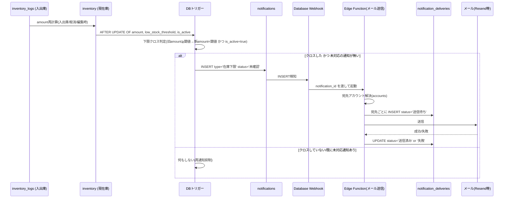

# 在庫下限メール通知機能 設計案

## 0. 前提・スコープ

- 対象は `inventory.amount`（研究室 or 溶媒庫が保有する在庫量）が `inventory.low_stock_threshold`（在庫下限しきい値）を下回った場合に、関係者へメールで知らせる機能。
- `docs/ER図.md` には既に `notifications` テーブルが「在庫下限 / 指定数量接近 / 指定数量超過」の3種別を扱うものとして定義済みであり（ER図.md 79-88行目）、「`settings.warning_ratio`(0.8) / 1.0 を超えたら `notifications` に記録＆メール通知」という記述（ER図.md 112行目）もある。つまり**「在庫下限をメールで通知する」という要件自体は既存設計に織り込み済み**で、今回未整備なのは
  1. 実際に**メール送信を実行・追跡する仕組み**（誰に・いつ・成功したか）
  2. **重複送信を防ぐ検知ロジック**（しきい値を跨いだ瞬間だけ送る）
  3. **送信先（宛先）の決定ルール**
  の3点である。この設計案はこの3点を中心に、既存テーブルとの整合を取りながら最小限の拡張を提案する。
- 「まず既存カラム・既存テーブルの拡張で実現できないか検討する」という判断基準（SKILL.md 57行目）に従い、`notifications` テーブルは**そのまま流用**し、新規テーブルは「1通知イベントに対して複数の送信先・複数の送信試行がありうる」という1:N関係を表現するために最小限だけ追加する。

## 1. 全体フロー



- 在庫再計算のたびに毎回メールを飛ばすのではなく、「しきい値以上→未満」に**クロスした瞬間**だけ `notifications` へ1件記録する。
- `notifications` への INSERT は同期的なDB処理に留め、外部I/O（メール送信）は Supabase の **Database Webhook → Edge Function** で非同期に行う。DBトリガー内で直接HTTP送信すると、トランザクション失敗時のロールバックや外部APIの遅延がDB本体に影響するため分離する（後述の代替案も記載）。

## 2. DBスキーマ変更点

### 2.1 既存テーブルの変更：なし（`notifications` はそのまま利用）

`notifications` の既存定義（ER図.md 79-88行目）を再掲する。

```
notifications {
    uuid id PK
    text type "在庫下限 / 指定数量接近 / 指定数量超過"
    uuid room_id FK "溶媒庫 or 研究室"
    uuid solvent_id FK "在庫下限通知のみ"
    numeric ratio "合算倍率(指定数量通知)"
    text message
    text status "未確認 / 確認済 / 対応済"
    timestamptz notified_at
}
```

在庫下限通知（`type='在庫下限'`）では、既存カラムをそのまま以下のように使う。**カラム追加は不要**。

| カラム | 在庫下限通知での使い方 |
|---|---|
| `room_id` | 下限を割った在庫が属する `room_id`（研究室・溶媒庫どちらもありうる） |
| `solvent_id` | 下限を割った溶媒。指定数量通知（溶媒庫単位で合算）とは異なり、在庫下限は個別の `inventory` 行に紐づくため必須 |
| `ratio` | 指定数量通知専用の列なので在庫下限では `NULL` のままにする（列の意味を混同しない） |
| `message` | 「〇〇（溶媒名）が下限（△△L）を下回りました。現在庫：□□L」等、送信時点の値をテキストとして固定化 |
| `status` | 既存の運用フロー（未確認→確認済→対応済）をそのまま使い、管理タブの通知一覧でステータス更新する |

`notifications` に**部分ユニークインデックス**を1本追加し、DBレベルで「同一在庫について未対応の通知は1件まで」を保証する（重複送信防止の最後の砦）。

```sql
CREATE UNIQUE INDEX uq_notifications_open_low_stock
  ON notifications (room_id, solvent_id)
  WHERE type = '在庫下限' AND status <> '対応済';
```

これはテーブル定義の追加カラムではなく制約の追加のみであり、`notifications` の意味を壊さない。

### 2.2 新規テーブル：`notification_deliveries`（メール送信の実行ログ）

**追加理由**：`notifications` は「起きた事象」を1件記録するテーブルだが、実際のメール送信は「誰に・何回・成功したか」という1:N・再試行ありの情報を持つ。これを `notifications` に直接持たせるとカラムの意味が『1通知＝1宛先』に固定されてしまい、複数宛先（研究室アカウント＋管理者）に送る際に破綻する。`operation_audits` が「変更イベント」と「変更履歴の詳細」を分けているのと同じ考え方で、通知イベント（`notifications`）と配送実績（`notification_deliveries`）を分離する。

```sql
CREATE TABLE notification_deliveries (
    id              uuid PRIMARY KEY DEFAULT gen_random_uuid(),
    notification_id uuid NOT NULL REFERENCES notifications(id),
    account_id      uuid REFERENCES accounts(id), -- 送信時点の宛先アカウント。将来アカウント削除時もNULL化のみ許容(物理削除しない方針に合わせる)
    email           text NOT NULL,                 -- 送信時点のメールアドレスをスナップショットとして保持(後日accounts.emailが変わっても送信実績は変えない)
    status          text NOT NULL DEFAULT '送信待ち', -- 送信待ち / 送信済み / 失敗
    attempt_count   integer NOT NULL DEFAULT 0,
    last_attempted_at timestamptz,
    sent_at         timestamptz,
    error_message   text,
    created_at      timestamptz NOT NULL DEFAULT now()
);

CREATE INDEX idx_notification_deliveries_notification_id
  ON notification_deliveries (notification_id);
```

- **物理削除しない方針**（SKILL.md 34行目）に合わせ、送信失敗しても行は消さず `status='失敗'` のまま残し、再送時は `attempt_count` を増やして同じ行を更新する（新規行を増やしてもよいが、監査性を優先するなら同一行更新を推奨）。
- 管理者が手動で「再送」した場合は、`operation_audits` に `target_type='notification'`, `action='再送信'` として記録する運用を推奨（既存の監査ログの枠組みをそのまま流用でき、テーブル追加は不要）。

### 2.3 `settings` への追加（テーブル定義変更なし、行の追加のみ）

`settings` は key-value 型（ER図.md 90-94行目）なので、スキーマ変更なしで以下の運用値を追加できる。

| key | value例 | 説明 |
|---|---|---|
| `notification_email_enabled` | `true` | メール通知の全体ON/OFFキルスイッチ |
| `notification_from_address` | `chemstock-noreply@example.ac.jp` | 送信元アドレス |
| `notification_cooldown_hours` | `24` | 対応済にした直後に同じ在庫が再度クロスした場合の最短再通知間隔（後述） |

これらは `settings.warning_ratio` と同じ「法令基準ではなくChemStock独自の運用値」であり（SKILL.md 53行目 / fire-law.md 21-25行目）、既存の位置づけと矛盾しない。

### 2.4 検討したが見送った変更

- **`accounts` へのカラム追加は不要**：`accounts.email`（ER図.md 31行目、「通知先メール」とコメント済み）をそのまま宛先解決に使う。
- **`inventory` へのカラム追加は不要**：`low_stock_threshold` と `is_active` が既にあり（ER図.md 52-53行目）、クロス判定・除外判定に十分。
- **`solvents` へのカラム追加は不要**：在庫下限は `inventory` 側の閾値で判定するものであり（SKILL.md 24行目「`low_stock_threshold`と`is_active`を持つのは在庫側、マスタ側ではない」）、溶媒マスタを変更すると設計方針と矛盾する。

## 3. クロス検知ロジックの詳細

DBトリガーは `inventory` テーブルの `AFTER UPDATE OF amount, low_stock_threshold, is_active` に設置する（`inventory_logs` へのINSERT起点にしない理由：入出庫だけでなく、取消・編集・しきい値変更でも `inventory.amount` や `low_stock_threshold` が再計算・更新される設計になっており（ER図.md 114行目「`operation_audits` に before/after を残し、`inventory.amount` を再計算」）、`inventory` の値が変わる経路をすべて1箇所で拾える）。

```sql
CREATE OR REPLACE FUNCTION fn_check_low_stock() RETURNS trigger AS $$
BEGIN
  IF NEW.is_active
     AND NEW.amount < NEW.low_stock_threshold
     AND NOT (OLD.amount < OLD.low_stock_threshold AND OLD.is_active) -- 直前は下限以上 or 利用停止中だった
  THEN
    INSERT INTO notifications (type, room_id, solvent_id, message, status, notified_at)
    VALUES (
      '在庫下限', NEW.room_id, NEW.solvent_id,
      format('在庫が下限を下回りました（現在庫 %s / 下限 %s）', NEW.amount, NEW.low_stock_threshold),
      '未確認', now()
    )
    ON CONFLICT DO NOTHING; -- 2.1の部分ユニークインデックスで多重INSERTを防止
  END IF;
  RETURN NEW;
END;
$$ LANGUAGE plpgsql;

CREATE TRIGGER trg_check_low_stock
AFTER UPDATE OF amount, low_stock_threshold, is_active ON inventory
FOR EACH ROW EXECUTE FUNCTION fn_check_low_stock();
```

- **再通知の抑制**：一度「未対応」（`status IN ('未確認','確認済')`）の通知があれば、部分ユニークインデックスにより新規INSERTは失敗し `ON CONFLICT DO NOTHING` で無視される。つまり同じ在庫が下限割れのまま何度出庫されてもメールは1通のみ。
- **再度クロスさせる条件**：管理者が在庫補充等で `対応済` にステータス変更した後、在庫が閾値以上→未満と再度クロスした場合のみ次の通知が生成される。`notification_cooldown_hours`（2.3）は、対応済にした直後の短時間での連続通知を抑えたい場合の追加ガードとして Edge Function 側でオプション実装する（必須ではない）。
- **利用停止在庫の除外**：`is_active=false` の在庫は判定対象から外す。既存ルール（SKILL.md 24行目）と整合。

## 4. 宛先（送信先）の決定ルール

在庫下限は「その `room_id` が保有する在庫」の事象であり、指定数量通知（溶媒庫単位の合算、管理者限定）とは性質が異なる。SKILL.md の可視性ルール（36行目）は「指定数量の合算倍率・通知は管理者向けであり、研究室ユーザーには見せない」と明記しているが、これは**合算値**についての制約であり、**自分の研究室・自分の溶媒庫の在庫が下限を割ったこと自体**は、その `room_id` に属するアカウントが知るべき自分ごとの情報である。したがって以下のルールを提案する。

| 宛先 | 条件 | 理由 |
|---|---|---|
| 当該 `room_id` に属する `accounts`（`role='研究室'` または `'溶媒庫管理'`） | `accounts.room_id = inventory.room_id` | 自室・自溶媒庫の在庫情報であり、可視性ルール上見せてよい範囲（SKILL.md 21行目「研究室＝使用者」） |
| `role='全体管理者'` の `accounts` | 常時（`notification_email_enabled=true` の場合） | 全学的な在庫状況の把握・法令対応の観点で管理者は全件把握する必要がある |

宛先解決は Edge Function 側で以下のようなクエリで行う想定（DDL変更ではなくアプリロジック）。

```sql
SELECT id, email FROM accounts
WHERE room_id = :room_id
   OR role = '全体管理者';
```

## 5. UI/UXへの影響（差分最小化）

- 「既存画面のフロー・コードは変更しない」方針（SKILL.md 45行目）に従い、新規画面は作らず**既存の管理タブ内「通知」項目に表示されている一覧をそのまま使う**（`notifications` テーブルの参照先を増やさないため、表示ロジックの変更は不要）。
- 研究室ユーザー向けには、ホーム画面や在庫詳細に「在庫下限」バッジ・警告表示を1行追加する程度に留める（下部タブバー5項目は固定のまま、SKILL.md 43行目）。指定数量関連の通知は従来通り管理者専用タブでのみ表示し、研究室ユーザーには一切出さない。
- メール本文中のリンクは、対象の在庫詳細画面（研究室ユーザーが元々見られる自室在庫ページ）に遷移させる。

## 6. 既存業務ルールとの整合性チェック

| ルール（SKILL.md） | 本設計での対応 |
|---|---|
| 1. 物理削除しない | `notification_deliveries` も DELETE せず、`status` 更新・`attempt_count` 加算で運用。再送は `operation_audits` に記録する運用を推奨。 |
| 2. 指定数量の合算は溶媒庫単位 | 本機能（在庫下限）は指定数量合算とは別の判定軸であり、既存の合算ロジック・`確認したい点`（ER図.md 118-120行目）には影響しない。両者は `notifications.type` で区別されるのみ。 |
| 3. 可視性の非対称 | 在庫下限通知の宛先は当該 `room_id` のアカウント＋全体管理者に限定し、他室の在庫下限情報は見せない。指定数量通知は従来通り管理者限定のまま変更しない。 |
| 4. 実操作者名は手入力 | 本機能は入出庫操作そのものではなくその結果（在庫量）をトリガーに送信するため、`operator_name` の扱いに変更はない。メール本文に必要なら直近の `inventory_logs.operator_name` を参考情報として載せる程度に留め、送信主体の特定には使わない。 |
| 5. 単位は`base_unit`で内部保持 | 通知メール本文中の数値は `inventory.amount`（基準単位）をそのまま使うか、表示時に `settings` の換算値で変換する。`amount`自体への書き込みは行わない。 |

## 7. 実装方式の代替案（トリガー＋Webhook以外）

MVPとして最初はシンプルにしたい場合、以下のバッチ方式でも同じスキーマ（`notifications` / `notification_deliveries`）をそのまま使い回せる。

- Supabase Scheduled Function（または Vercel Cron）が数分〜数十分間隔で `inventory` を走査し、`amount < low_stock_threshold AND is_active` かつ未対応の `notifications` が存在しない行を検出して `notifications` へINSERTし、そのままメール送信まで行う。
- リアルタイム性は落ちるが、DBトリガー・Webhookの運用コストが不要になる。将来的にトリガー方式へ移行してもテーブル構造は変わらない。

設計判断としてはどちらを採用してもテーブル定義（`notifications` 流用＋`notification_deliveries` 新設）は共通のため、初期リリースはバッチ方式、利用が進んでからトリガー方式へ、という段階移行も可能。

## 8. 未確定・要確認事項（運用側との合意が必要な点）

- **宛先範囲**：4章の「`role='溶媒庫管理'`も含めるか」「他研究室の在庫下限も溶媒庫管理者に見せてよいか」は業務運用次第で調整が必要。
- **クールダウン期間**：`notification_cooldown_hours` の具体的な値（24時間か、営業日ベースか）は運用担当と要相談。
- **ダイジェスト化**：将来的に「1日1通にまとめる」ダイジェスト送信が必要になった場合は、`notifications` は個別イベントのまま残し、Edge Function側で集約送信するだけで対応可能（スキーマ変更不要）。
- **ER図.md 118-120行目の未確定事項**（研究室が自室で保管する危険物溶媒を指定数量合算に含めるか）は本機能とは独立した論点であり、本設計案の実装可否には影響しない。
