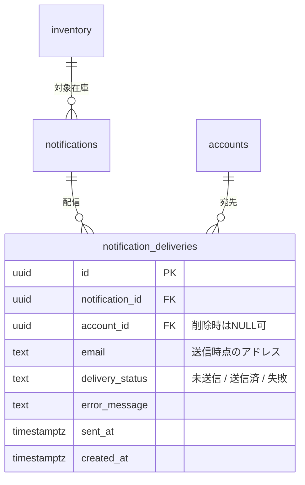

# 在庫下限メール通知機能 設計案

## 0. 前提・スコープ

- 対象：`inventory.amount`（研究室・溶媒庫ごとの在庫量）が `low_stock_threshold`（在庫下限しきい値）を下回った際に、関係者へメールで通知する機能。
- ベース：既存の `docs/ER図.md` はこの機能を見据えて `inventory.low_stock_threshold` と `notifications` テーブルを既に定義済み（`type: "在庫下限"`）。本設計はこの土台を前提に、
  1. **実際にメールを送信するための仕組み**（誰に・いつ・どう送るか）
  2. **重複通知を防ぐための状態管理**
  3. **既存の現行実装（`supabase/setup.sql`）からの移行**
  を具体化するものであり、`docs/ER図.md` の設計方針と矛盾しないよう追加・拡張のみを行う。
- 現行実装（`supabase/setup.sql`）は `rooms / solvents / inventory / inventory_logs` の4テーブルのみで、`accounts / operation_audits / notifications / settings` はまだ存在せず、認証は Supabase Auth（`app/auth/*`）のみで運用されている。したがって本設計は「ER図.md の拡張スキーマを実装する」フェーズの一部として位置づける。

---

## 1. 全体アーキテクチャ

```
[在庫更新]                      [検知]                         [配信]
inventory.amount 更新     →  DB トリガーで下限割れを検知   →  notifications に1行 INSERT
(残量調整画面 / 取消・編集)      （重複防止ロジック込み）         ↓（Database Webhook）
                                                          Edge Function（send-low-stock-email）
                                                              ↓
                                                     外部メール送信API（Resend 等）
                                                              ↓
                                                    notification_deliveries に結果を記録
```

ポイントは **「在庫更新」「下限判定」「配信」を分離する**こと。

- 判定（下限を下回ったか）は **Postgres トリガー**でDB内に閉じて行う → アプリ側（Next.js）のどの画面から在庫が変わっても（残量調整・取消・編集いずれでも）漏れなく検知できる。
- 配信（実際にメールを送る）は **Supabase Database Webhook → Edge Function → メール送信API** に分離する → Postgres 内から直接外部APIを叩かず、失敗時のリトライや送信ログ管理をアプリ層に持たせる。

---

## 2. DBスキーマ設計（変更点）

### 2.1 既存テーブルとの関係整理

`docs/ER図.md` に既に定義されている以下は**そのまま採用**し、変更しない。

| テーブル | 本機能で使うカラム |
|---|---|
| `inventory` | `low_stock_threshold`（下限しきい値）, `is_active`（利用停止中は通知しない） |
| `rooms` | `kind`（研究室／溶媒庫の区別。宛先決定に使用） |
| `accounts` | `email`（通知先メール）, `role`, `room_id` |
| `solvents` | `name`（メール本文表示用） |
| `notifications` | `type / room_id / solvent_id / message / status / notified_at`（イベント記録として活用） |
| `operation_audits` | 通知の「対応済」変更などの操作履歴を残す先として活用（後述） |
| `settings` | 通知まわりの運用パラメータ置き場として活用 |

この機能で**新規追加**するのは以下の2点のみ。

1. `notifications` テーブルへの列追加（1列）
2. `notification_deliveries` テーブルの新設（誰に・いつ・成功したかを記録）
3. `settings` への設定キー追加（アプリ側の運用値）

既存の8テーブル構成・命名規則（`text` で状態を表す、`timestamptz`、`uuid` PK、監査は `operation_audits` に集約、など）はすべて踏襲する。

### 2.2 `notifications` テーブルの拡張

```sql
alter table notifications
  add column inventory_id uuid references inventory(id) on delete cascade;
```

- ER図.md では `room_id` と `solvent_id` から間接的に対象在庫を特定できるが（`inventory` は `unique(room_id, solvent_id)`）、通知発生時点の在庫レコードを直接指せるよう `inventory_id` を追加する。
- 既存の `room_id` / `solvent_id` 列は「研究室ユーザーへの表示や指定数量通知（`solvent_id` を使わないケース）との互換性」のために**そのまま残す**（後方互換・非破壊）。
- `status` 列（未確認／確認済／対応済）は既存のまま、通知の**ライフサイクル管理**にそのまま利用する（3.2節）。

### 2.3 `notification_deliveries` テーブル（新規）

「1件の通知イベント（notifications）」に対して「誰に送ったか」は1対多になる（研究室の共有アカウント＋溶媒庫管理者＋全体管理者が同時に対象になりうるため）。これを `notifications` に直接持たせると正規化が崩れるため、別テーブルに切り出す。

```sql
create table notification_deliveries (
  id uuid default uuid_generate_v4() primary key,
  notification_id uuid references notifications(id) on delete cascade not null,
  account_id uuid references accounts(id) on delete set null,
  email text not null,                         -- 送信時点のメールアドレスをスナップショット
  delivery_status text not null default '未送信', -- 未送信 / 送信済 / 失敗
  error_message text,                           -- 失敗時のAPIエラー内容
  sent_at timestamptz,
  created_at timestamptz default timezone('utc'::text, now()) not null
);

create index idx_notification_deliveries_notification_id
  on notification_deliveries(notification_id);
create index idx_notification_deliveries_status
  on notification_deliveries(delivery_status)
  where delivery_status <> '送信済';
```

- `account_id` はアカウント削除後も履歴を残したいので `on delete set null`（`email` に送信時点の値をスナップショットしているため、アカウントが消えても「誰にいつ送ったか」の事実は残る）。
- 既存テーブルの命名（日本語ステータス文字列を `text` で持つ）と揃え、`operation_audits.action` などと表記スタイルを統一。

### 2.4 `settings` への追加キー

ER図.md の `settings`（`key text PK / value text / description text`）はそのまま使い、以下のキーを追加する（テーブル構造の変更は不要）。

| key | value（例） | 説明 |
|---|---|---|
| `notification_email_enabled` | `true` | メール通知の機能自体のON/OFF |
| `notification_from_address` | `noreply@chemstock.example.ac.jp` | 送信元メールアドレス |
| `low_stock_renotify_hours` | `24` | 「対応済」にした後、まだ下限を下回っている場合に再通知するまでの待機時間（クールダウン） |

### 2.5 ER図.md への追記（差分イメージ）



既存の `notifications { ... }` ブロックには `uuid inventory_id FK "対象在庫（追加）"` を1行追記する。

---

## 3. 通知トリガーロジック

### 3.1 しきい値割れ検知（DBトリガー）

`inventory.amount` または `low_stock_threshold` が更新されるたびに判定する。アプリ側の実装箇所（残量調整・取消・編集のどの画面経由でも）に依存しないようDB層で完結させる。

```sql
create or replace function fn_check_low_stock() returns trigger as $$
declare
  v_open_id uuid;
  v_last_resolved_at timestamptz;
  v_cooldown_hours int;
  v_solvent_name text;
  v_room_name text;
begin
  -- 利用停止中、または下限を下回っていなければ何もしない
  if not new.is_active or new.low_stock_threshold is null
     or new.amount > new.low_stock_threshold then
    return new;
  end if;

  select name into v_solvent_name from solvents where id = new.solvent_id;
  select name into v_room_name from rooms where id = new.room_id;

  -- (a) 既に未対応（未確認/確認済）の通知が残っていれば、新規は作らず notified_at のみ更新
  select id into v_open_id
    from notifications
   where room_id = new.room_id and solvent_id = new.solvent_id
     and type = '在庫下限' and status <> '対応済'
   limit 1;

  if v_open_id is not null then
    update notifications set notified_at = now() where id = v_open_id;
    return new;
  end if;

  -- (b) 直近「対応済」がクールダウン内なら再通知しない
  select value::int into v_cooldown_hours from settings where key = 'low_stock_renotify_hours';
  select notified_at into v_last_resolved_at
    from notifications
   where room_id = new.room_id and solvent_id = new.solvent_id
     and type = '在庫下限' and status = '対応済'
   order by notified_at desc limit 1;

  if v_last_resolved_at is not null
     and v_last_resolved_at > now() - make_interval(hours => coalesce(v_cooldown_hours, 24)) then
    return new;
  end if;

  -- (c) 新規通知を1件発行（この INSERT を Database Webhook がフックしてメール送信へ）
  insert into notifications (type, room_id, solvent_id, inventory_id, message, status, notified_at)
  values (
    '在庫下限', new.room_id, new.solvent_id, new.id,
    format('%s の %s 残量が %s（下限 %s）を下回りました', v_room_name, v_solvent_name, new.amount, new.low_stock_threshold),
    '未確認', now()
  );

  return new;
end;
$$ language plpgsql;

create trigger trg_inventory_low_stock
  after update of amount, low_stock_threshold, is_active on inventory
  for each row execute function fn_check_low_stock();
```

### 3.2 重複通知抑制のまとめ

| 状況 | 挙動 |
|---|---|
| 下限割れ後、連続して在庫が変動（まだ未対応） | 新規レコードは作らず既存通知の `notified_at` を更新するのみ＝メール再送しない |
| 管理者が「対応済」に変更した直後にまた下限割れ | `low_stock_renotify_hours`（既定24h）以内は再通知しない |
| クールダウンを過ぎても下限を下回ったまま | 新規 `notifications` 行を発行 → メール再送 |
| `is_active = false`（利用停止中） | 通知対象外 |

`status` の「未確認→確認済→対応済」への変更は、既存の運用ルール通り **アプリのUI操作**（`docs/UI案.md` の管理者画面「🔔 通知一覧」）から行い、変更時は既存の `operation_audits`（`target_type = 'notification'`, `action = '確認' / '対応済'`）に記録することで、他の変更操作（取消・編集・しきい値変更）と同じ監査の枠組みに統一する。

### 3.3 通知対象者（宛先）の決定ロジック

`notifications` 発行時（3.1の(c)）に合わせて、宛先を展開して `notification_deliveries` を作る。宛先は以下のUNIONとする。

- 通知対象の `room_id` に紐づく `accounts`（研究室の共有アカウント本人）
- `role = '溶媒庫管理'` の `accounts`（`room_id` は溶媒庫、または全研究室共通の管理担当）
- `role = '全体管理者'` の `accounts`（`room_id is null` の全体管理者は常に含める）

```sql
select id, email from accounts
 where room_id = :target_room_id
    or role in ('溶媒庫管理', '全体管理者');
```

この宛先展開処理と実送信は次章の Edge Function 側で行う（DBトリガー内で外部APIを直接叩かない）。

---

## 4. メール送信の実装方式

### 4.1 Database Webhook + Edge Function

- `notifications` テーブルへの `INSERT`（`type = '在庫下限'`）を **Supabase Database Webhook** でフックし、Edge Function `send-low-stock-email` を呼び出す。
- DBトリガーから直接 `pg_net` 等でHTTPを叩く方式もあるが、失敗時のリトライやログ管理をアプリ層（Edge Function／Next.js）に寄せた方が運用しやすいため、Webhook経由を推奨。

### 4.2 Edge Function処理フロー

1. Webhook経由で `notification_id` を受け取る。
2. 3.3の宛先クエリで対象 `accounts` を取得し、`notification_deliveries` に `未送信` で人数分INSERT。
3. `settings.notification_email_enabled` が `false` なら送信せず終了（開発・保守停止用のキルスイッチ）。
4. 各宛先へメール送信APIを呼び出し（例：Resend / SendGrid）。件名例：「【ChemStock】〇〇研究室 メタノール 在庫下限」。本文に `notifications.message`・現在庫量・下限値・在庫詳細画面へのリンクを含める。
5. 成否に応じて `notification_deliveries.delivery_status` を `送信済`／`失敗`（`error_message`）に更新し `sent_at` を記録。

### 4.3 再送・失敗時のリトライ

- `delivery_status = '失敗'` の行を対象に、5〜10分間隔の再送バッチ（Supabase Cron / pg_cron で Edge Function を再呼び出し）を用意し、最大リトライ回数（例：3回）を超えたら諦めて `失敗（再送停止）` とする。
- ここは `notification_deliveries` を主語にした独立の再送ジョブなので、`notifications` 本体のステータス（未確認/確認済/対応済）とは独立して動く。

---

## 5. 通知ステータスとUIとの連携

`docs/UI案.md` に既にある以下2つのUIは、そのまま本設計の `notifications` を参照する形で実現できる（UI側の追加変更は不要）。

- **ホーム画面「⚠ 残量低下のお知らせ」バナー**：`notifications` を `room_id = ログイン中の研究室` かつ `type = '在庫下限'` かつ `status = '未確認'` で絞り込み表示。
- **管理者画面「🔔 通知一覧」**：全 `notifications` を `status` 別（未確認/確認済/対応済）にタブ表示し、行タップで `status` を更新（更新時に `operation_audits` へ記録）。

メール本文中のリンクは、この通知一覧または在庫詳細画面（`app/inventory/detail/[id]`）に遷移させ、確認操作をシームレスにする。

---

## 6. 移行手順（現行スキーマ → 拡張後）

現行 `supabase/setup.sql` には `low_stock_threshold` や `notifications` 系のテーブルが未実装のため、以下の順でマイグレーションする（`docs/ER図.md` が既に定義済みの部分＋本設計の追加分）。

```sql
-- 1) inventory の拡張（ER図.md 準拠、未実装分）
alter table inventory
  add column if not exists low_stock_threshold numeric(10,2),
  add column if not exists is_active boolean not null default true;

-- 2) accounts テーブル新設（ER図.md 準拠、未実装）
create table if not exists accounts (
  id uuid default uuid_generate_v4() primary key,
  room_id uuid references rooms(id),
  login_id text not null,
  role text not null default '研究室',
  email text,
  created_at timestamptz default timezone('utc'::text, now()) not null
);

-- 3) notifications / settings テーブル新設（ER図.md 準拠、未実装）
create table if not exists notifications (
  id uuid default uuid_generate_v4() primary key,
  type text not null,
  room_id uuid references rooms(id),
  solvent_id uuid references solvents(id),
  inventory_id uuid references inventory(id) on delete cascade, -- 本設計での追加分
  ratio numeric,
  message text,
  status text not null default '未確認',
  notified_at timestamptz default timezone('utc'::text, now()) not null
);

create table if not exists settings (
  key text primary key,
  value text,
  description text
);

-- 4) notification_deliveries テーブル新設（本設計の追加分）
create table if not exists notification_deliveries ( ... );  -- 2.3節参照

-- 5) 既存在庫データへのデフォルト下限値投入（運用開始前に管理者が値を調整する前提の暫定値）
update inventory set low_stock_threshold = 0 where low_stock_threshold is null;

-- 6) settings 初期値投入
insert into settings (key, value, description) values
  ('notification_email_enabled', 'true', 'メール通知の有効/無効'),
  ('notification_from_address', 'noreply@chemstock.example.ac.jp', '送信元アドレス'),
  ('low_stock_renotify_hours', '24', '対応済後の再通知クールダウン(時間)')
on conflict (key) do nothing;

-- 7) トリガー作成（3.1節参照）
```

`inventory_logs`（入出庫履歴）は変更不要。在庫量の変化は最終的に `inventory.amount` の更新として反映されるため、トリガーは `inventory` にだけ張れば入出庫・取消・編集のどの経路でも一律に検知できる。

---

## 7. セキュリティ・RLS

- `accounts.email` および `notification_deliveries.email` は個人情報に準ずるため、RLSで**全体管理者・溶媒庫管理ロールのみ閲覧可**とし、研究室ロールは自分の `room_id` の範囲のみ閲覧可とする（既存の `accounts` の可視性方針＝ER図.md「可視性」節と同一ルール）。
- Edge Function からのDB更新（`notification_deliveries` への書き込み）は `service_role` キーを使用し、通常のRLSをバイパスする専用経路として扱う（クライアントから直接 `notification_deliveries` を更新させない）。
- メール送信APIキー（Resend等）はSupabaseの Edge Function Secrets に保管し、フロントエンド・DBのどこにも平文で置かない。

---

## 8. 既存テーブルとの整合性まとめ

| 既存要素（ER図.md） | 本設計での扱い | 整合性 |
|---|---|---|
| `inventory.low_stock_threshold` | 判定条件としてそのまま使用 | 変更なし |
| `inventory.is_active` | 利用停止中は通知除外の条件に使用 | 変更なし |
| `notifications`（type/room_id/solvent_id/status等） | イベント記録として使用、`inventory_id` を1列追加のみ | 後方互換（追加のみ） |
| `accounts`（email/role/room_id） | 宛先決定ロジックの入力として使用 | 変更なし |
| `operation_audits` | 通知ステータス変更（確認/対応済）の監査記録先として流用 | 既存の監査方針に統一（新規テーブル不要） |
| `settings`（key/value/description） | 運用パラメータ（ON/OFF・送信元・クールダウン）を追加 | 構造変更なし、行の追加のみ |
| `rooms.kind` | 宛先ロジックでは直接使わないが、将来「溶媒庫の指定数量通知」と宛先ロジックを共通化する際の分岐に利用可能 | 変更なし |
| `inventory_logs` | 変更なし。トリガーは `inventory` 側に張るため無関係 | 変更なし |

新規に追加するのは `notifications.inventory_id` 列（1つ）と `notification_deliveries` テーブル（1つ）のみであり、`docs/ER図.md` が既に定めた8テーブル構成・命名規則・監査方針（`operation_audits` に集約する設計思想）を壊さずに実装できる。

---

## 9. 未確定事項・今後の検討

- **メール送信サービスの選定**：Resend / SendGrid / 大学のSMTPサーバーのいずれを使うかは未確定。大学ドメインのSMTP必須の場合、Edge Function側の実装（4.2節）をSMTP送信に差し替える想定。
- **指定数量通知（`type = '指定数量接近' / '指定数量超過'`）との共通化**：本設計は在庫下限通知に絞ったが、`notification_deliveries` と宛先決定ロジック（3.3節）は指定数量通知にもそのまま流用できる設計にしてある。指定数量通知を実装する際は `fn_check_low_stock` と同様のトリガーを `rooms.kind = '溶媒庫'` の合算ロジック（ER図.md「設計上の決定・前提」参照）に対して追加する形になる。
- **`docs/ER図.md`「確認したい点」との関係**：研究室が自室で危険物溶媒を保管する場合の指定数量合算範囲の扱いは未解決のままだが、在庫下限通知（本設計）は研究室単位の `low_stock_threshold` のみを見るため、この論点の結論に依存せず先行実装可能。
- **メール本文の多言語対応・書式**は本設計のスコープ外（必要であれば別途UI/文言設計が必要）。
