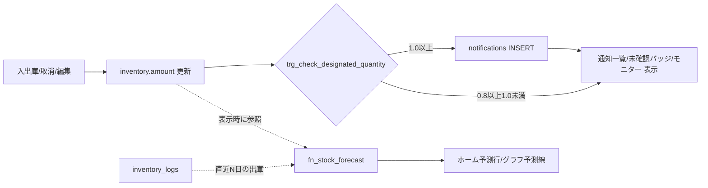

# DXコア機能 データ設計（指定数量監視・欠品予測）

[DXコア機能_要件定義](DXコア機能_要件定義.md) に対応するデータ設計。
全体のデータモデルは [ER図](ER図.md) を正とし、本書は**コア2機能が必要とする範囲**の
具体的な差分DDL・集計ロジック・判定ロジックを定義する。既存要件定義書・ER図とは別文書。

## 0. 現行スキーマとの差分サマリ

現行 `supabase/setup.sql` は rooms / solvents / inventory / inventory_logs の4テーブルのみ。
ER図で設計済みのうち、**本機能に必要な分だけ**を先行してマイグレーションする。

| テーブル | 変更 | 使う機能 |
|---|---|---|
| `rooms` | 変更なし（全行を「溶媒庫内の研究室」として扱う。`kind` 追加は不要） | F1 |
| `solvents` | `designated_quantity`・`hazard_class`・`base_unit` 列を追加 | F1 |
| `inventory` | `low_stock_threshold`・`is_active` 列を追加 | F1・F2 |
| `inventory_logs` | 変更なし（取消機能実装時に `status` 追加予定。§4参照） | F2 |
| `notifications` | 新規作成（指定数量専用。在庫下限は通知として持たない：要件§2.1） | F1 |
| `settings` | 新規作成（ER図準拠） | F1・F2 |

`accounts` / `operation_audits` は本機能の完全動作（管理者認可・しきい値変更の監査）に
必要だが、認証・監査機能側の実装範囲なので本書では前提（依存）として扱う（§6）。

## 1. マイグレーションDDL

```sql
-- 1-1. rooms: 変更なし。全行が「溶媒庫内の研究室」を表す。
--      研究室の自室在庫は対象外（記録しない）ため、kind 列による区別は不要。

-- 1-2. solvents: 指定数量（法令値はDBに保持し、コードにハードコードしない）
alter table solvents
  add column if not exists designated_quantity numeric(10, 2),  -- NULL = 指定数量対象外/未設定
  add column if not exists hazard_class text,                   -- 例: '第4類第一石油類'
  add column if not exists base_unit text not null default 'L';

-- 1-3. inventory: 下限しきい値と利用状態
alter table inventory
  add column if not exists low_stock_threshold numeric(10, 2),  -- NULL = 未設定（予測・下限判定の対象外）
  add column if not exists is_active boolean not null default true;

-- 1-4. notifications（指定数量専用。在庫下限は通知として持たない：要件定義§2.1）
create table if not exists notifications (
  id uuid default uuid_generate_v4() primary key,
  type text not null check (type = '指定数量超過'),
  ratio numeric(10, 3) not null,    -- 発生時点の合算倍数
  message text not null,
  status text not null default '未確認',   -- '未確認' / '確認済' / '対応済'
  notified_at timestamptz default timezone('utc'::text, now()) not null
);

-- 重複抑制（F1-5）：未対応の指定数量超過通知は1件まで（DBレベルで保証。溶媒庫は単一）
create unique index if not exists uq_notifications_open_designated
  on notifications (type)
  where type = '指定数量超過' and status <> '対応済';

-- 1-5. settings（ER図準拠、key-value）
create table if not exists settings (
  key text primary key,
  value text not null,
  description text
);

insert into settings (key, value, description) values
  ('warning_ratio', '0.8', 'モニターの接近表示に使う倍率（通知発火条件・法令基準ではない）'),
  ('forecast_window_days', '30', '欠品予測に使う消費実績の参照日数'),
  -- 以下は設定値ではなく再通知のヒステリシス管理用の運用フラグ（要件 F1-6b）。
  -- 倍数が1.0未満に戻るとtrue、超過通知の発行時にfalseへ落とす。
  ('dq_arm_over', 'true', '指定数量超過の再アーム状態（運用フラグ・trueなら再通知可）')
on conflict (key) do nothing;
```

## 2. F1 指定数量監視のデータロジック

### 2-1. 合算倍数の集計ビュー

画面表示（指定数量モニター）と通知判定の両方がこのビューを参照し、計算式を1箇所に集約する。

```sql
create or replace view designated_quantity_status as
select
  sum(i.amount / s.designated_quantity) as total_ratio
from inventory i
join solvents s on s.id = i.solvent_id
where i.is_active
  and s.designated_quantity is not null
  and s.designated_quantity > 0;
```

- 溶媒別内訳（モニター画面用）は同条件で `group by` を溶媒まで下げたクエリを使う。
- `amount` は基準単位で保持されている前提（単位混在させない）。

### 2-2. 判定・通知生成トリガー

在庫量が変わるすべての経路（入出庫・取消・編集・利用停止）は最終的に `inventory` 行の
UPDATE に集約されるが、**新規溶媒の初回入庫では `inventory` 行が INSERT される**（現行 setup.sql は
全 room×solvent をseedで先行作成するが、その前提に依存せず漏れを防ぐ）。よってトリガーは
`inventory` の **INSERT と UPDATE の両方**に張る（F1-2の漏れ防止）。

```sql
create or replace function fn_check_designated_quantity() returns trigger as $$
declare
  v_ratio numeric;
  v_armed boolean;
begin
  -- 在庫はすべて溶媒庫内（研究室別）にあるため、全在庫の合算で判定する
  select total_ratio into v_ratio from designated_quantity_status;
  v_ratio := coalesce(v_ratio, 0);

  -- 再アーム（ヒステリシス・F1-6b）：1.0未満へ戻ったら再通知可能にする。
  if v_ratio < 1.0 then
    update settings set value = 'true' where key = 'dq_arm_over';
    return coalesce(new, old);
  end if;

  -- 1.0以上かつアーム済みのときだけアプリ内通知を発行する。
  -- 0.8以上1.0未満はモニターの接近表示だけで、notificationsには記録しない。
  select value::boolean into v_armed from settings where key = 'dq_arm_over';

  if coalesce(v_armed, true) then
    insert into notifications (type, ratio, message, status)
    values (
      '指定数量超過', round(v_ratio, 3),
      format('指定数量の倍数が %s になり、1.0以上となりました', round(v_ratio, 2)),
      '未確認'
    )
    on conflict do nothing;  -- 未対応通知が残る間の重複抑制（F1-5・部分ユニークインデックス）
    update settings set value = 'false' where key = 'dq_arm_over';
  end if;
  return coalesce(new, old);
end;
$$ language plpgsql;

create trigger trg_check_designated_quantity
  after insert or update of amount, is_active on inventory
  for each row execute function fn_check_designated_quantity();
```

判定の仕様：

| 状況 | 挙動 |
|---|---|
| 0.8以上1.0未満になった | モニターを「接近」表示にする。通知は発行しない |
| 1.0以上になった（アーム済・未対応通知なし） | 「指定数量超過」のアプリ内通知を1件発行し、超過をディスアーム |
| 新規溶媒の初回入庫で1.0以上 | INSERTトリガーで発火（F1-2） |
| 未対応通知が残ったまま在庫が変動 | 新規発行なし（`on conflict do nothing`） |
| 1.0以上のまま「対応済」にした直後に在庫変動 | 再通知しない（ディスアーム維持・F1-6b） |
| 1.0未満に戻った | 通知は自動で消さない。管理者が「対応済」へ変更する。超過通知は再アームされ、次に1.0へ再到達したとき再通知する |

### 2-3. アプリ内通知と未確認バッジ（F1-4 / F1-9）

管理タブ／管理者画面の未確認件数は `notifications` を直接集計する（バッジ用の別テーブルは持たない）。
溶媒庫は単一のため、溶媒庫管理・全体管理者ともスコープは同一（全件。F1-8）。
初回はアプリ内通知のみを作る。メール通知は初回後の追加候補であり、送信先・方式・送信失敗時の扱いを決めてから配送記録を設計する。

```sql
select count(*) from notifications where status = '未確認';
```

## 3. F2 欠品予測のデータロジック

**新規テーブルは作らない**。予測は `inventory_logs` からのオンデマンド計算とする
（履歴が正であり、予測値を保存すると実績との二重管理になるため）。

```sql
-- 在庫ごとの欠品予測（表示時にRPCまたはビューとして呼び出す）
create or replace function fn_stock_forecast(p_room_id uuid)
returns table (
  inventory_id uuid,
  solvent_name text,
  amount numeric,
  low_stock_threshold numeric,
  daily_consumption numeric,
  predicted_date date
) as $$
  with params as (
    select (select value::int from settings where key = 'forecast_window_days') as window_days
  ),
  consumption as (
    select l.inventory_id,
           sum(-l.change_amount) / p.window_days as daily_avg  -- 出庫(負)のみを日次平均化
    from inventory_logs l, params p
    where l.change_amount < 0
      and l.created_at >= now() - make_interval(days => p.window_days)
      and l.status = '有効'  -- 取消済みの出庫は消費実績から除外する
    group by l.inventory_id, p.window_days
  )
  select
    i.id, s.name, i.amount, i.low_stock_threshold, c.daily_avg,
    (current_date + ceil((i.amount - i.low_stock_threshold) / c.daily_avg)::int) as predicted_date
  from inventory i
  join solvents s on s.id = i.solvent_id
  join consumption c on c.inventory_id = i.id
  where i.room_id = p_room_id
    and i.is_active
    and i.low_stock_threshold is not null
    and c.daily_avg > 0
    and i.amount > i.low_stock_threshold;  -- 既に下限割れはホームバナーの「下限割れ中」状態表示に任せる（通知は出さない：F2-4/§2.1）
$$ language sql stable;
```

仕様のポイント：

- **消費のみ**（`change_amount < 0`）を実績とする。入庫は消費ペースに含めない。
- 予測不能条件（F2-4）はSQLの `where` 句がそのまま表現している：出庫実績なし（joinで落ちる）／下限未設定／下限割れ済み／利用停止。
- `p_room_id` を必須引数とし、**自研究室以外の予測を返さない**（可視性ルールをAPI境界でも守る）。
- 単純な線形外挿から始め、精度改善（曜日・学期性の考慮など）は関数内の実装差し替えで対応できる。
- **「下限割れ中」（`amount ≤ low_stock_threshold`）の表示はこの関数の対象外**（`i.amount > i.low_stock_threshold` で除外している）。ホームバナー §1 の「下限割れ中」状態（⚠）は、既存の在庫一覧の下限判定（自研究室の `is_active` かつ `amount ≤ low_stock_threshold`）を再利用して別クエリで取得する。予測（🕒）と状態表示（⚠）は別データ源であり、いずれも `notifications` は発行しない（要件 §2.1 / F2-4）。

## 4. 既存テーブルとの整合性・依存関係

| 項目 | 整合性の確認 |
|---|---|
| `inventory_logs.user_name` | 現行実装の列名。ER図の `operator_name` への改名は取消・編集機能の実装範囲であり、本機能は列名に依存しない（`change_amount`・`created_at` のみ使用） |
| `inventory_logs.status` | 取消機能と欠品予測を初回リリースで提供するため、予測クエリは最初から `status='有効'` の履歴だけを使う |
| 物理削除しない原則 | notifications は削除せず `status` 遷移のみ。設定変更・通知ステータス変更は `operation_audits`（実装後）に記録 |
| 単位 | すべての計算は `base_unit` の値のまま行い、換算は表示層のみ |
| 可視性 | 指定数量系（ビュー・モニター・通知）は管理者ロールのみ参照可にRLSを設定。`fn_stock_forecast` は自研究室IDのみ受け付ける |

## 5. データフロー全体図



## 6. 前提（他機能への依存）

- **accounts**：アプリ内通知を閲覧できる溶媒庫管理・全体管理者の認可に必要。
- **operation_audits**：`warning_ratio`・`forecast_window_days` の変更監査に必要。未実装の間、設定変更UIは全体管理者のみに制限して運用でカバーする。
