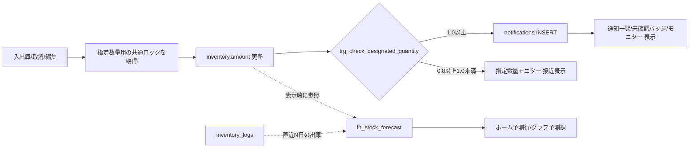

# DXコア機能 データ設計（指定数量監視・欠品予測）

[DXコア機能_要件定義](DXコア機能_要件定義.md) に対応するデータ設計。
全体のデータモデルは [ER図](ER図.md) を正とし、本書は**コア2機能が必要とする範囲**の
具体的な差分DDL・集計ロジック・判定ロジックを定義する。既存要件定義書・ER図とは別文書。

## 0. 現行スキーマとの差分サマリ

現行 `supabase/setup.sql` は rooms / solvents / inventory / inventory_logs の4テーブルのみ。
同ファイルの部屋一覧と全組合せ在庫は旧デモ用であり、「溶媒庫」行や居室・実験室の在庫行を本番へ引き継がない。本番では、確認済みの溶媒庫内の研究室だけを`rooms`へ登録する。
ER図で設計済みのうち、**本機能に必要な分だけ**を先行してマイグレーションする。

| テーブル | 変更 | 使う機能 |
|---|---|---|
| `rooms` | 列追加なし。本番の各行は「溶媒庫内の研究室」。`kind`列や溶媒庫そのものの行は不要 | F1 |
| `solvents` | `designated_quantity`・`hazard_class`・`base_unit` 列を追加 | F1 |
| `inventory` | `low_stock_threshold`・`is_active`・推移の起点となる`opening_amount`・`opened_at`を追加 | F1・F2 |
| `inventory_logs` | `status`（`active` / `cancelled`）と業務発生日時`occurred_at`を追加。取消・訂正・欠品予測・推移で同じ履歴を扱う | F2 |
| `notifications` | 新規作成（指定数量専用。在庫下限は通知として持たない：要件§2.1） | F1 |
| `settings` | 新規作成（ER図準拠） | F1・F2 |

`accounts` / `operation_audits` は本機能の完全動作（管理者認可・しきい値変更の監査）に
必要だが、認証・監査機能側の実装範囲なので本書では前提（依存）として扱う（§6）。

## 1. マイグレーションDDL

```sql
-- 1-1. rooms: 変更なし。全行が「溶媒庫内の研究室」を表す。
--      研究室の自室在庫は対象外（記録しない）ため、kind 列による区別は不要。

-- 1-2. solvents: 指定数量（法令値はDBに保持し、コードにハードコードしない）
alter table solvents
  add column if not exists designated_quantity numeric(10, 2),  -- NULL = 指定数量対象外/未設定
  add column if not exists hazard_class text,                   -- 例: '第4類第一石油類'
  add column if not exists base_unit text not null default 'L';
alter table solvents
  add constraint chk_solvents_designated_quantity_positive
    check (designated_quantity is null or designated_quantity > 0);
-- 初回リリースの基準単位はLに統一。入力・表示のガロン／斗缶は換算設定で扱う。
alter table solvents
  add constraint chk_solvents_base_unit check (base_unit = 'L');

-- 1-3. inventory: 下限しきい値と利用状態
alter table inventory
  add column if not exists low_stock_threshold numeric(10, 2),  -- NULL = 未設定（予測・下限判定の対象外）
  add column if not exists is_active boolean not null default true,
  add column if not exists opening_amount numeric(10, 2),
  add column if not exists opened_at timestamptz;
alter table inventory
  add constraint chk_inventory_amount_nonnegative check (amount >= 0),
  add constraint chk_inventory_low_stock_threshold_nonnegative
    check (low_stock_threshold is null or low_stock_threshold >= 0),
  add constraint chk_inventory_opening_amount_nonnegative
    check (opening_amount is null or opening_amount >= 0);

-- 1-4. inventory_logs: 記録日時とは別に、業務上の入出庫日時を保持する
alter table inventory_logs
  add column if not exists status text not null default 'active';
alter table inventory_logs
  add constraint chk_inventory_logs_status check (status in ('active', 'cancelled'));
alter table inventory_logs
  add constraint chk_inventory_logs_nonzero_change check (change_amount <> 0);
alter table inventory_logs
  add column if not exists occurred_at timestamptz;
-- 既存の開発用履歴に発生日時がなければ、登録日時を初期値にする。
update inventory_logs set occurred_at = created_at where occurred_at is null;
alter table inventory_logs
  alter column occurred_at set default now(),
  alter column occurred_at set not null;

-- 1-5. notifications（指定数量専用。在庫下限は通知として持たない：要件定義§2.1）
create table if not exists notifications (
  id uuid default uuid_generate_v4() primary key,
  type text not null check (type = 'designated_quantity_exceeded'),
  ratio numeric(10, 3) not null,    -- 発生時点の合算倍数
  message text not null,
  status text not null default 'unread'
    check (status in ('unread', 'acknowledged', 'resolved')),
  notified_at timestamptz default timezone('utc'::text, now()) not null
);

-- 重複抑制（F1-5）：未対応の指定数量超過通知は1件まで（DBレベルで保証。溶媒庫は単一）
create unique index if not exists uq_notifications_open_designated
  on notifications (type)
  where type = 'designated_quantity_exceeded' and status <> 'resolved';

-- 1-6. settings（ER図準拠、key-value）
create table if not exists settings (
  key text primary key,
  value text not null,
  description text
);

insert into settings (key, value, description) values
  ('warning_ratio', '0.8', 'モニターの接近表示に使う倍率（通知発火条件・法令基準ではない）'),
  ('forecast_window_days', '30', '欠品予測に使う消費実績の参照日数'),
  ('unit_gal_to_l', '3.8', '既存の+/-1 gal操作と同じ換算値（1 gal=3.8 L）'),
  ('unit_tokan_to_l', '18', '18 L缶1缶をLに換算する係数'),
  -- 以下は設定値ではなく再通知のヒステリシス管理用の運用フラグ（要件 F1-6b）。
  -- 倍数が1.0未満に戻るとtrue、超過通知の発行時にfalseへ落とす。
  ('dq_arm_over', 'true', '指定数量超過の再アーム状態（運用フラグ・trueなら再通知可）')
on conflict (key) do nothing;
```

既存行に制約違反がある場合は、値と確認元を調査してから移行する。指定数量値を0・負数で「対象外」にせず、未設定はNULLで表し、管理者向けモニターの未設定一覧に出す。`settings` は文字列を格納するため、設定変更CommandとDB側の検証関数でキー別に型・範囲を確認してから更新する。`warning_ratio` は0より大きく1より小さい有限小数、`forecast_window_days` は1〜365の整数、単位係数は初回リリースの規格値3.8・18、`dq_arm_over` は内部処理だけが`true`/`false`に変更できる。必要な設定キーの欠落・不正値を欠品予測の空結果として扱わず、設定エラーとして検知する。設定変更時は監査を同一トランザクションに残す。基準単位Lの数量は小数第2位まで、在庫下限は0以上またはNULLとし、API検証とDB制約の両方で守る。

初回リリースの操作単位はL・ガロン（米液量）・斗缶（18 L缶）とし、既存の[残量調整画面](../app/inventory/adjust/page.tsx)のボタンに合わせて1 gal=3.8 L、1斗缶=18 Lとする。ガロンの3.8 Lは既存アプリで使う丸めた操作値である。溶媒ごとの指定数量値は確認済みのL値を別途登録する。設定値を読めない場合は換算入力を停止して設定エラーを出し、推測の係数で保存しない。係数は初回の管理画面では編集させず、変更が必要なら確認・監査を伴う管理用移行で扱う。

`opening_amount`・`opened_at`は移行時に一時的にNULLを許容し、確認済みの本番初期在庫と記録開始日時で埋めてからNOT NULLにする。旧デモ行の値から初期残高を推定して本番へ移さない。新規在庫は初期値0と作成時刻を起点にし、最初の入庫を履歴に記録する。初期投入では確認済み数量を`opening_amount`と`amount`の両方に同一トランザクションで設定し、指定数量を再判定する。初回リリースではその後の数量変化を有効な入出庫履歴と対応させ、`amount = opening_amount + sum(activeなchange_amount)`を検証する。棚卸調整を追加する際は出庫と別種別の履歴を設計し、消費実績から除外する。

## 2. F1 指定数量監視のデータロジック

### 2-1. 合算倍数の集計ビュー

画面表示（指定数量モニター）と通知判定の両方がこのビューを参照し、計算式を1箇所に集約する。全研究室の在庫を読むため、ビューはData APIに公開しない`private`スキーマに置く。ビューの所有者には全研究室を集計できる権限を与え、`anon`・`authenticated`にはビューへの直接SELECT権限を与えない。管理者画面は[API設計 §4-1](API設計.html#4-1-db権限境界)の認可付きQuery RPCから参照する。ビュー所有者によるRLSの扱いをマイグレーション時に確認し、`FORCE ROW LEVEL SECURITY`を使う場合も全室集計が維持されるようにする。

```sql
create schema if not exists private; -- Supabase Data API の公開スキーマに追加しない
revoke all on schema private from public, anon, authenticated;

create or replace view private.designated_quantity_status as
select
  sum(i.amount / s.designated_quantity) as total_ratio
from public.inventory i
join public.solvents s on s.id = i.solvent_id
where i.is_active
  and s.designated_quantity is not null
  and s.designated_quantity > 0;

revoke all on private.designated_quantity_status from public, anon, authenticated;
```

- 溶媒別内訳（モニター画面用）は同条件で `group by` を溶媒まで下げたクエリを、管理者認可付き内部Query RPC内で使う。
- `amount` は基準単位で保持されている前提（単位混在させない）。

### 2-2. 同時更新時の直列化

単一の溶媒庫の倍数と再通知状態は、研究室をまたぐ共通の状態である。異なる `inventory` 行への入庫を行ロックだけで処理すると、各トランザクションが相手の未確定の入庫を見ずに1.0未満と判定し、確定後の合算が1.0以上でも通知がない状態になり得る。

指定数量の倍数・通知状態に影響する **すべての書き込みCommand RPC** は、PostgreSQL の `READ COMMITTED` で、在庫行や履歴行のロック・変更および合算の読み取りより**先に**同じトランザクション単位のアドバイザリロックを取得する。`1128813396, 1` は単一溶媒庫の指定数量判定専用キーとし、他用途へ流用しない。ロックはトランザクション終了時に解放される。

```sql
-- 各Command RPCの認可確認後、対象行のロック・変更より前に実行する。
perform pg_advisory_xact_lock(1128813396, 1);
-- 続いて対象行をロックし、更新する。AFTERトリガーが確定済みの先行更新と
-- このトランザクション自身の更新を含む合算を、新しい文のスナップショットで読む。
```

対象には入出庫、履歴取消・訂正、在庫の初回作成・数量編集・利用停止/再開・溶媒変更、`solvents.designated_quantity` の変更、通知の状態変更、本番初期データ投入を含める。通知状態変更も同じロックを使い、未対応通知の有無と `dq_arm_over` の変更順序を固定する。`designated_quantity` の変更時は溶媒マスタ側のトリガーで再判定する。公開APIに使うDBロールから対象表への直接書き込みを許さず、認可付きRPCを通す。管理用の移行・投入処理も同じロック手順に従う。

この判定は `READ COMMITTED` と `VOLATILE` 関数の文ごとの新しいスナップショットを前提とする。ロック待ち後に合算を読み直すため、先行トランザクションが確定した在庫を含めて判定できる。`REPEATABLE READ` / `SERIALIZABLE` へ分離レベルを変更する場合は、再試行を含めて別途設計・検証する。

### 2-3. 判定・通知生成トリガー

在庫量が変わるすべての経路（入出庫・取消・編集・利用停止）は最終的に `inventory` 行の
UPDATE に集約されるが、**新規溶媒の初回入庫では `inventory` 行が INSERT される**（現行 setup.sql は
全 room×solvent をseedで先行作成するが、その前提に依存せず漏れを防ぐ）。よってトリガーは
`inventory` の **INSERT と UPDATE の両方**に張る（F1-2の漏れ防止）。複数行を1文で更新した場合の途中状態ではなく更新後の合算を判定するため、文単位の `AFTER` トリガーにする。溶媒の指定数量値を変更した場合も同じ関数で再判定する。

```sql
create or replace function private.fn_check_designated_quantity() returns trigger as $$
declare
  v_ratio numeric;
  v_armed boolean;
begin
  -- 在庫はすべて溶媒庫内（研究室別）にあるため、全在庫の合算で判定する
  select total_ratio into v_ratio from private.designated_quantity_status;
  v_ratio := coalesce(v_ratio, 0);

  -- 再アーム（ヒステリシス・F1-6b）：1.0未満へ戻ったら再通知可能にする。
  if v_ratio < 1.0 then
    update public.settings set value = 'true' where key = 'dq_arm_over';
    return null;
  end if;

  -- 1.0以上かつアーム済みのときだけアプリ内通知を発行する。
  -- 0.8以上1.0未満はモニターの接近表示だけで、notificationsには記録しない。
  select value::boolean into v_armed from public.settings where key = 'dq_arm_over';

  if coalesce(v_armed, true) then
    insert into public.notifications (type, ratio, message, status)
    values (
      'designated_quantity_exceeded', round(v_ratio, 3),
      format('指定数量の倍数が %s になり、1.0以上となりました', round(v_ratio, 2)),
      'unread'
    )
    on conflict do nothing;  -- 未対応通知が残る間の重複抑制（F1-5・部分ユニークインデックス）
    update public.settings set value = 'false' where key = 'dq_arm_over';
  end if;
  return null;
end;
$$ language plpgsql volatile security definer set search_path = '';

-- 関数の既定の PUBLIC 実行権限を取り消し、クライアントに直接公開しない。
revoke all on function private.fn_check_designated_quantity() from public, anon, authenticated;

create trigger trg_check_designated_quantity
  after insert or update of amount, is_active, solvent_id on public.inventory
  for each statement execute function private.fn_check_designated_quantity();

create trigger trg_check_designated_quantity_solvent
  after update of designated_quantity on public.solvents
  for each statement execute function private.fn_check_designated_quantity();
```

トリガーは内部の書き込み専用とする。`SECURITY DEFINER`の所有者にはビュー、`settings`、`notifications`の必要な権限だけを与え、所有者・`search_path`・`EXECUTE`権限をマイグレーションで固定する。直接DMLを許すと共通ロックを飛ばせるため、クライアントの表更新権限は§4に従って取り消す。

判定の仕様：

| 状況 | 挙動 |
|---|---|
| 0.8以上1.0未満になった | モニターを「接近」表示にする。通知は発行しない |
| 1.0以上になった（アーム済・未対応通知なし） | 「指定数量超過」のアプリ内通知を1件発行し、超過をディスアーム |
| 新規溶媒の初回入庫で1.0以上 | INSERTトリガーで発火（F1-2） |
| 異なる研究室からの同時入庫で合算が1.0以上 | 共通ロック取得後に順番に判定し、再アーム済み・未対応通知なしなら1件発行する |
| 指定数量値の変更で1.0以上 | 溶媒マスタのUPDATEトリガーで同じ再通知条件に従って判定する |
| 未対応通知が残ったまま在庫が変動 | 新規発行なし（`on conflict do nothing`） |
| 1.0以上のまま「対応済」にした直後に在庫変動 | 再通知しない（ディスアーム維持・F1-6b） |
| 1.0未満に戻った | 通知は自動で消さない。管理者が「対応済」へ変更する。超過通知は再アームされ、次に1.0へ再到達したとき再通知する |

### 2-4. アプリ内通知と未確認バッジ（F1-4 / F1-9）

管理タブ／管理者画面の未確認件数は、管理者認可付きQuery RPC内で `notifications` を集計する（バッジ用の別テーブルは持たない）。クライアントには表の直接SELECTを許可しない。
溶媒庫は単一のため、溶媒庫管理・全体管理者ともスコープは同一（全件。F1-8）。
初回はアプリ内通知のみを作る。メール通知は初回後の追加候補であり、送信先・方式・送信失敗時の扱いを決めてから配送記録を設計する。

```sql
-- 管理者認可付きQuery RPCの内部クエリ
select count(*) from public.notifications where status = 'unread';
```

## 3. F2 欠品予測のデータロジック

**新規テーブルは作らない**。予測は `inventory_logs` からのオンデマンド計算とする
（履歴が正であり、予測値を保存すると実績との二重管理になるため）。

```sql
-- 在庫ごとの欠品予測。public の同名 SECURITY INVOKER RPC から呼ぶ内部関数。
create or replace function private.fn_stock_forecast(p_room_id uuid)
returns table (
  inventory_id uuid,
  solvent_name text,
  amount numeric,
  low_stock_threshold numeric,
  daily_consumption numeric,
  predicted_date date
) as $$
  with authorized as (
    select 1 from public.accounts a
    where a.id = auth.uid()
      and (a.role = 'global_admin'
        or (a.role in ('lab', 'solvent_room_admin') and a.room_id = p_room_id))
  ),
  params as (
    select (select value::int from public.settings where key = 'forecast_window_days') as window_days
  ),
  consumption as (
    select l.inventory_id,
           sum(-l.change_amount) / p.window_days as daily_avg  -- 出庫(負)のみを日次平均化
    from public.inventory_logs l, params p
    where l.change_amount < 0
      and l.occurred_at >= now() - make_interval(days => p.window_days)
      and l.occurred_at <= now()
      and l.status = 'active'  -- cancelled の出庫は消費実績から除外する
    group by l.inventory_id, p.window_days
  )
  select
    i.id, s.name, i.amount, i.low_stock_threshold, c.daily_avg,
    (current_date + ceil((i.amount - i.low_stock_threshold) / c.daily_avg)::int) as predicted_date
  from public.inventory i
  join public.solvents s on s.id = i.solvent_id
  join consumption c on c.inventory_id = i.id
  cross join authorized
  where i.room_id = p_room_id
    and i.is_active
    and i.low_stock_threshold is not null
    and c.daily_avg > 0
    and i.amount > i.low_stock_threshold
    and ceil((i.amount - i.low_stock_threshold) / c.daily_avg) <= 365; -- 初回は365日以内のみ日付を返す
$$ language sql stable security definer set search_path = '';

revoke all on function private.fn_stock_forecast(uuid) from public, anon, authenticated;
-- 公開スキーマの入口は SECURITY INVOKER。内部関数自身も auth.uid() と accounts で認可する。
create or replace function public.fn_stock_forecast(p_room_id uuid)
returns table (
  inventory_id uuid,
  solvent_name text,
  amount numeric,
  low_stock_threshold numeric,
  daily_consumption numeric,
  predicted_date date
) language sql stable security invoker set search_path = '' as $$
  select * from private.fn_stock_forecast(p_room_id);
$$;
revoke all on function public.fn_stock_forecast(uuid) from public, anon;
grant usage on schema private to authenticated;
grant execute on function private.fn_stock_forecast(uuid) to authenticated;
grant execute on function public.fn_stock_forecast(uuid) to authenticated;
```

内部関数の所有者は`accounts`・`settings`・在庫・履歴・溶媒マスタを読むための権限を持つ。公開入口に付けた`SECURITY INVOKER`だけでは内部関数を保護できないため、内部関数にも上記の所属確認を残す。`private`スキーマのUSAGEは内部関数呼び出しに必要だが、ビューのSELECTは付与しない。

仕様のポイント：

- **消費のみ**（`change_amount < 0`）を実績とする。入庫は消費ペースに含めない。
- 直近N日の範囲は`occurred_at`（実際の入出庫日時）で判定する。後日登録・訂正した履歴は`created_at`ではなく発生日時の期間に反映する。`created_at`はDBへの記録日時として保持し、業務日時の訂正でも変更しない。
- 実績推移は`max(要求期間の開始, opened_at)`を開始点とし、開始時残量を`opening_amount + sum(開始点より前に発生したactiveなchange_amount)`で作る。その後の有効な履歴を`occurred_at, created_at, id`順に加算する。履歴0件でも初期在庫から現在までの水平な線を返す。記録開始前の点は返さず、`occurred_at < opened_at`の登録・訂正は拒否する。現在値との照合には全期間の有効な履歴を用いる。
- 予測不能条件（F2-4）はSQLの `where` 句がそのまま表現している：出庫実績なし（joinで落ちる）／下限未設定／下限割れ済み／利用停止／予測到達が365日超。日数が365以下かを数値のまま判定してから整数・日付へ変換し、極小の消費量による整数範囲外エラーを避ける。
- `p_room_id` は対象を絞る引数であり、認可の根拠ではない。内部関数が`auth.uid()`に紐付く`accounts.role`・`room_id`を確認する。研究室・溶媒庫管理は所属研究室のみ、全体管理者は任意の研究室を取得できる。未認可の`room_id`では行を返さない。出庫実績がない正規の研究室も空結果になるため、APIは呼び出し前に対象研究室の存在と閲覧権限を別途確認し、権限外・存在しないIDだけを404にする。
- 単純な線形外挿から始め、精度改善（曜日・学期性の考慮など）は関数内の実装差し替えで対応できる。
- **「下限割れ中」（`amount ≤ low_stock_threshold`）の表示はこの関数の対象外**（`i.amount > i.low_stock_threshold` で除外している）。ホームバナー §1 の「下限割れ中」状態（⚠）は、既存の在庫一覧の下限判定（自研究室の `is_active` かつ `amount ≤ low_stock_threshold`）を再利用して別クエリで取得する。予測（🕒）と状態表示（⚠）は別データ源であり、いずれも `notifications` は発行しない（要件 §2.1 / F2-4）。

## 4. 既存テーブルとの整合性・依存関係

| 項目 | 整合性の確認 |
|---|---|
| `inventory_logs.user_name` | 現行実装の列名。ER図の `operator_name` への改名は取消・編集機能の実装範囲であり、本機能は列名に依存しない（`change_amount`・`occurred_at`・`status`を使用） |
| `inventory_logs.occurred_at` | 入出庫時に省略された場合はサーバー時刻。過去日時の登録・訂正は監査し、欠品予測と実績推移は訂正後の発生日時で再計算する。`created_at`は登録日時として不変 |
| `inventory_logs.status` | 取消機能と欠品予測を初回リリースで提供するため、DBとAPIの保存値を`active` / `cancelled`に統一し、予測クエリは`status='active'`の履歴だけを使う |
| 物理削除しない原則 | notifications は削除せず `status` 遷移のみ。設定変更・通知ステータス変更は `operation_audits`（実装後）に記録 |
| 単位 | 入力画面は`settings.unit_gal_to_l`・`unit_tokan_to_l`でLに換算し、確定前に保存するL値を表示する。DB・APIの計算と保存は基準単位L、表示は同じ係数で逆換算する。係数の欠落・不正時は入力を止める |
| 可視性 | 指定数量ビューは非公開スキーマに置き、管理者認可付きQuery RPCから全室集計を読む。研究室別の直接参照はRLS、列の非公開は列単位権限で制限する。`fn_stock_forecast` は引数だけを信用せず、DB内で`auth.uid()`と所属を照合する |

## 5. データフロー全体図



## 6. 前提（他機能への依存）

- **accounts**：アプリ内通知を閲覧できる溶媒庫管理・全体管理者の認可に必要。
- **operation_audits**：`warning_ratio`・`forecast_window_days` の変更監査に必要。監査テーブルと原子的なCommandが完成するまで、設定変更UIとAPIは有効化しない。全体管理者の権限だけでは監査欠落を補えない。
