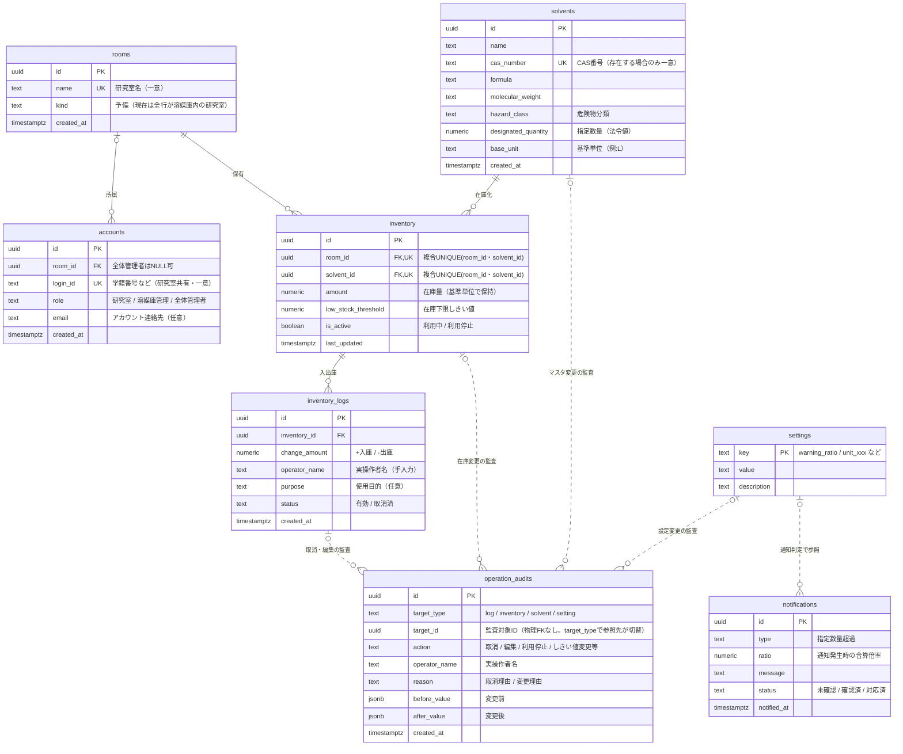

# ChemStock ER図（データ関連定義）

要件定義（機能要件・非機能要件）に基づくデータモデル。
既存テーブル（rooms / solvents / inventory / inventory_logs）を拡張し、
編集・取消（監査）、研究室別溶媒種類管理、指定数量監視（通知）、単位切替に対応する。
在庫下限（残量低下）は通知として持たず、研究室の画面表示（欠品予測バナー・在庫の ⚠）で扱う（要件定義 §2.1）。

## ER図

全テーブルを1枚にまとめ、物理的な外部キーと業務上の論理参照を同時に示す。

- 実線は外部キーによる物理的な関係を示す。
- 点線は外部キーを持たない業務上の論理参照・依存関係を示す。
- PK＝主キー、FK＝外部キー、UK＝一意制約（UNIQUE）。
- `rooms`↔`accounts` は `accounts.room_id` がNULL可（全体管理者はどの研究室にも属さない）のため、`rooms`側を「zero or one」としている。
- `inventory` は `room_id` と `solvent_id` の複合UNIQUE制約を持つ（1研究室×1溶媒につき在庫行は1つ）。Mermaid記法では複合UNIQUEを1本の制約として表現できないため、両カラムに `UK` を付与し注記で複合であることを明示している。
- `operation_audits.target_id` は `target_type` によって参照先テーブルが切り替わるため、物理的なFKは持たない（論理参照のみ）。
- `operation_audits` は `target_type` と `target_id` で監査対象を判別する。
- `notifications` は指定数量系（管理者向け）専用。溶媒庫は単一のため `room_id` は持たない。溶媒庫管理・全体管理者が全件を閲覧する（要件定義 F1-4 / F1-8）。

## テーブル説明

| テーブル | 役割 | 主な追加点 |
|---|---|---|
| rooms | **溶媒庫内の研究室** | 1行＝1研究室。`name`はUNIQUE。研究室の自室在庫は対象外（記録しない） |
| accounts | ログイン（研究室共有）と管理者ロール | 共有アカウント＋role。`login_id`はUNIQUE |
| solvents | 溶媒マスタ（全体共通） | `designated_quantity`（指定数量）`hazard_class``base_unit`。`cas_number`はUNIQUE（存在する場合） |
| inventory | 研究室別の保有・管理対象 | `low_stock_threshold`（下限）`is_active`（利用停止）。`(room_id, solvent_id)`は複合UNIQUE |
| inventory_logs | 入出庫履歴 | `operator_name`（実操作者）`status`（取消フラグ）`purpose` |
| operation_audits | 監査ログ（取消・編集・利用停止・しきい値変更） | 変更前後(`before/after`)・理由を記録。`target_type/id`で多対象（物理FKなし） |
| notifications | 通知履歴（**指定数量専用**。在庫下限は持たない） | `status`（未確認/確認済/対応済）で運用管理。管理者全員が全件閲覧 |
| settings | 全体設定 | 警告しきい値(0.8)・単位換算値など。`key`がPK |

## 設計上の決定・前提

- **指定数量の合算 = 溶媒庫全体（全研究室）**：在庫はすべて溶媒庫内の研究室にあるため、全在庫を `Σ(amount ÷ designated_quantity)` で合算する。0.8以上1.0未満はモニターの接近表示のみ、1.0以上は `notifications` に「指定数量超過」を記録する。初回はアプリ内通知のみで、研究室ユーザーには見せない。メールは初回後の追加候補。
- **可視性**：研究室ユーザーは自研究室(`room_id`)の在庫のみ閲覧。合算倍率・指定数量通知は管理者向け（溶媒庫管理・全体管理者とも全件）。
- **在庫下限（残量低下）は通知として持たない**：研究室が自研究室のホームバナー（欠品予測）＋在庫の ⚠ で把握。`notifications` は発行しない（要件定義 §2.1）。管理タブ/管理者画面には指定数量超過の未確認件数バッジを表示（F1-9）。
- **取消・編集は物理削除しない**：`inventory_logs.status='取消済'` で在庫計算から除外、データは保持。値の訂正(編集)も `operation_audits` に before/after を残し、`inventory.amount` を再計算。
- **実操作者名は手入力**（共有アカウントのため）。過去入力をサジェスト表示。
- **単位**：`inventory.amount` は `solvents.base_unit` で保持。**入力時も L／ガロン／斗缶 から単位を選択**でき、保存前に `base_unit` へ換算する。表示時も `settings` の換算値で変換（換算値をコードにハードコードしない）。
- **研究室はログインから自動決定**：操作・閲覧対象の研究室は `accounts.room_id` から自動判定する。研究室ユーザーに研究室選択UIは出さない（管理者ロールのみ全研究室を選択可）。

## 確認済みの決定

- 研究室が**自室**で保管する溶媒：**対象外で確定**（2026-07-19）。システムに記録しないため指定数量合算にも含まれない。溶媒庫内は研究室ごとに分かれ、**全研究室を合算対象**とする。
