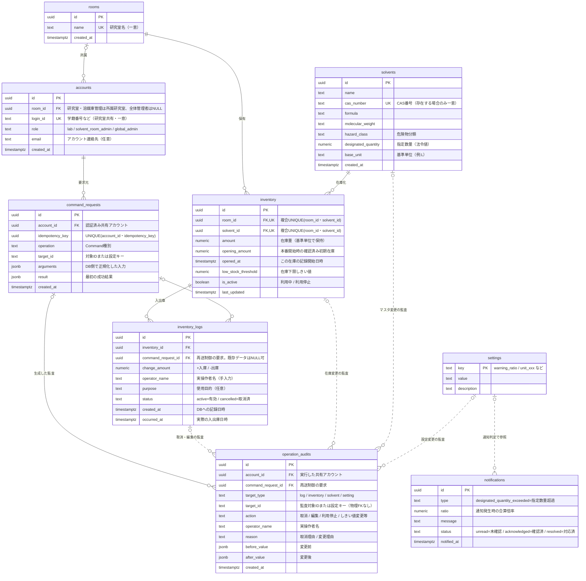

# ChemStock ER図（データ関連定義）

要件定義（機能要件・非機能要件）に基づくデータモデル。
既存テーブル（rooms / solvents / inventory / inventory_logs）を拡張し、
編集・取消（監査）、研究室別溶媒種類管理、指定数量監視（通知）、単位切替に対応する。
在庫下限（残量低下）は通知として持たず、研究室の画面表示（欠品予測バナー・在庫の ⚠）で扱う（要件定義 §2.1）。

## ER図

全テーブルを1枚にまとめ、物理的な外部キーと業務上の論理参照を同時に示す。

- 実線は外部キーによる物理的な関係を示す。
- 点線は外部キーを持たない業務上の論理参照・依存関係を示す。
- PK＝主キー、FK＝外部キー、UK＝一意制約（UNIQUE）。
- `rooms`↔`accounts` は `accounts.room_id` がNULL可（全体管理者のみ所属研究室なし）のため、`rooms`側を「zero or one」としている。研究室・溶媒庫管理アカウントは所属研究室を必須とする。
- `inventory` は `room_id` と `solvent_id` の複合UNIQUE制約を持つ（1研究室×1溶媒につき在庫行は1つ）。Mermaid記法では複合UNIQUEを1本の制約として表現できないため、両カラムに `UK` を付与し注記で複合であることを明示している。
- `operation_audits.target_id` は `target_type` によって参照先テーブルが切り替わるため、物理的なFKは持たない（論理参照のみ）。
- `operation_audits` は `target_type` と `target_id` で監査対象を判別する。
- `command_requests` は状態変更Commandの再送を `(account_id, idempotency_key)` で一意に制御する。履歴・監査からの参照は非一意とし、同じCommandが複数行を生成できる。業務更新と成功結果は同一トランザクションで確定する。既存データの参照列は移行時にNULLを許容する。
- `notifications` は指定数量系（管理者向け）専用。溶媒庫は単一のため `room_id` は持たない。溶媒庫管理・全体管理者が全件を閲覧する（要件定義 F1-4 / F1-8）。

## テーブル説明

| テーブル | 役割 | 主な追加点 |
|---|---|---|
| rooms | **溶媒庫内の研究室** | 1行＝1研究室。`name`はUNIQUE。溶媒庫そのものの行や`kind`列は設けない。研究室の自室在庫は対象外（記録しない） |
| accounts | ログイン（研究室共有）と管理者ロール | 共有アカウント＋role。`login_id`はUNIQUE。研究室・溶媒庫管理は所属研究室を持ち、全体管理者の`room_id`はNULL |
| solvents | 溶媒マスタ（全体共通） | `designated_quantity`（指定数量）`hazard_class``base_unit`。`cas_number`はUNIQUE（存在する場合） |
| inventory | 研究室別の保有・管理対象 | `opening_amount`・`opened_at`が推移の起点。`low_stock_threshold`（下限）`is_active`（利用停止）。`(room_id, solvent_id)`は複合UNIQUE |
| inventory_logs | 入出庫履歴 | `operator_name`（実操作者）`status`（`active` / `cancelled`）`purpose` |
| operation_audits | 監査ログ（取消・編集・利用停止・しきい値変更） | 変更前後(`before/after`)・理由を記録。`target_type/id`で多対象（物理FKなし） |
| command_requests | 状態変更要求と成功結果 | 同一アカウントの再送キーを一意に保持し、操作・入力の差異を検出。直接表アクセスは禁止 |
| notifications | 通知履歴（**指定数量専用**。在庫下限は持たない） | `type='designated_quantity_exceeded'`。`status`は`unread` / `acknowledged` / `resolved`。管理者全員が全件閲覧 |
| settings | 全体設定 | 警告しきい値(0.8)・単位換算値など。`key`がPK |

## 設計上の決定・前提

- **指定数量の合算 = 溶媒庫全体（全研究室）**：在庫はすべて溶媒庫内の研究室にあるため、全在庫を `Σ(amount ÷ designated_quantity)` で合算する。0.8以上1.0未満はモニターの接近表示のみ、1.0以上は `notifications` に「指定数量超過」を記録する。初回はアプリ内通知のみで、研究室ユーザーには見せない。メールは初回後の追加候補。
- **可視性**：研究室ユーザーは自研究室(`room_id`)の在庫のみ閲覧。合算倍率・指定数量通知は管理者向け（溶媒庫管理・全体管理者とも全件）。
- **溶媒庫管理の操作範囲**：研究室別在庫・履歴の参照と更新は`accounts.room_id`の所属研究室に限る。指定数量の合算倍率・通知は全研究室分を参照・対応できる。
- **在庫下限（残量低下）は通知として持たない**：研究室が自研究室のホームバナー（欠品予測）＋在庫の ⚠ で把握。`notifications` は発行しない（要件定義 §2.1）。管理タブ/管理者画面には指定数量超過の未確認件数バッジを表示（F1-9）。
- **取消・編集は物理削除しない**：`inventory_logs.status='cancelled'` で在庫計算から除外、データは保持。値の訂正(編集)も `operation_audits` に before/after を残し、`inventory.amount` を再計算。
- **履歴の2つの日時**：`created_at`はDBへの記録日時として不変。`occurred_at`は実際の入出庫日時で、省略時はサーバー時刻。後日登録・訂正時にも欠品予測の直近N日判定と実績推移の時刻は`occurred_at`を使う。日時訂正の前後値と理由は監査に残す。
- **初期在庫と実績推移**：確認済みの初期在庫を`opening_amount`、記録開始を`opened_at`に保存する。開始後の在庫量は初期在庫と有効な入出庫差分の合計に一致させる。推移の開始点より前へは遡らず、開始前の入出庫日時は登録・訂正とも拒否する。初回リリース中の開始後の数量変更は入出庫履歴と対応させ、在庫量だけを直接書き換えない。将来の棚卸調整は出庫と区別して記録し、欠品予測の消費量に混ぜない。
- **実操作者名は手入力**（共有アカウントのため）。過去入力をサジェスト表示。
- **単位**：`inventory.amount` は基準単位Lで保持。**入力時も L／ガロン／斗缶 から単位を選択**でき、保存前にLへ換算する。換算規格は既存の残量調整画面と同じ1 gal=3.8 L、1斗缶=18 Lとし、実装時は`settings.unit_gal_to_l`・`unit_tokan_to_l`から取得する。表示も同じ係数で変換する。
- **研究室はログインから自動決定**：研究室・溶媒庫管理アカウントの操作・閲覧対象は `accounts.room_id` の所属研究室に固定し、研究室選択UIは出さない。全体管理者のみ操作対象の研究室を選択できる。溶媒庫管理アカウントは研究室別操作とは別に、指定数量の全室集計と通知を扱える。
- **DBの認可境界**：研究室別の参照は `accounts.id = auth.uid()` を起点とするRLS、指定数量の全室集計・通知は非公開スキーマと管理者認可付きQuery RPCで制御する。溶媒マスタの指定数量関連列は列単位権限で直接参照を制限する。業務表の直接DMLは許可せず、DB内でも所属とロールを再確認するCommand RPCを使う（詳細は[API設計 §4-1](API設計.html#4-1-db権限境界)）。

## 確認済みの決定

- 研究室が**自室**で保管する溶媒：**対象外で確定**（2026-07-19）。システムに記録しないため指定数量合算にも含まれない。溶媒庫内は研究室ごとに分かれ、**全研究室を合算対象**とする。
