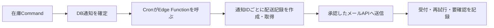

# 指定数量超過のメール通知

状態：配送記録、Microsoft Graph経路、専用GmailアカウントのGoogle Apps Script経路をローカル実装済み。大学ドメインの新規アドレスと既存の管理者用共有アドレスの送信権限は未確認。大学アドレスから送れない場合の専用Gmailアドレス利用は了承済み。実際のアドレス作成・実Supabaseへの適用・実送信は未実施。DBの初期設定は無効。

## 決定済みの範囲

- 送信先は溶媒庫管理者用の共有アドレス1件。通知発生時の宛先を配送記録に保存する。共有アドレスの転送先は学内で管理する。
- 差出人は運用担当が管理し、受信者がChemStockからの通知と識別できる固定アドレスにする。既存の管理者用共有アドレスから送信できればそれを使う。難しい場合はChemStock専用に用意するGmailアドレスを使える。新しい大学ドメインのアドレスは必須条件にしない。
- メール機能のコードは用意するが、初回は無効のまま導入する。送信開始は学内の差出人・権限・受信確認後に別途有効化する。
- 送信基盤は、確定した差出人を正規に使えるものを選ぶ。現在のワーカーはMicrosoft GraphとGoogle Apps Scriptの両方に対応する。専用Gmail案では、そのGmailアカウントが所有するApps Scriptの`MailApp`を使う。Supabase Edge FunctionsからはHTTPSで呼び出す。

## 差出人を確定する条件

受信者に見える`From`アドレス、表示名、返信先を先に決める。専用Gmail経路は表示名「ChemStock 溶媒庫通知」、`Reply-To`を管理者用共有アドレスに設定する。表示名や`Reply-To`を変えても、受信者に見える`From`の実アドレスは変わらない。Microsoft Graph経路の表示名は大学側のメールボックス設定によるため、実受信で確認する。

| 差出人の候補 | 受信者に見える`From` | 追加で確認すること |
|---|---|---|
| 既存の管理者用共有アドレス | その共有アドレス | 大学のメール管理者が送信権限を許可できるか。Microsoft 365ならGraphの送信権限、Google Workspaceなら送信アカウントまたは確認済みエイリアスを確認する |
| ChemStock専用のGmailアドレス | その`@gmail.com`アドレス | 運用担当によるアカウント管理・復旧方法、Google OAuthまたはApps Scriptの認可、共有アドレスでの受信と迷惑メール判定を確認する |

専用Gmailアドレスは大学ドメインを必要としない。Apps Scriptは専用アカウントの所有者権限で実行し、実行アカウントとDBに登録した差出人が一致する場合だけ送る。スクリプト内でも宛先を共有アドレス1件に固定する。Webアプリは専用の長いトークンを要求する。スクリプトの送信回数にはGoogleの割当があり、個人GmailのApps Scriptは現在1日100受信者が目安なので、稼働前に現行値と通知頻度を確認する。大学の共有アドレスを未承認のまま`From`に設定する仕組みではない。

DBには承認した差出人・宛先と確認時刻を保存する。両方が確認済みになるまでメール機能を有効化できない。配送記録にも差出人と宛先を保存し、現在のGraphワーカーではDBの差出人がFunctionの`M365_SENDER`と一致するときだけ送る。

## 発火条件と処理

単一の溶媒庫にある全研究室の在庫を合算した指定数量倍率が1.0以上となり、DBに`designated_quantity_exceeded`通知が作られたときだけ対象にする。0.8倍の接近表示、研究室別の在庫下限、通知の確認・対応状態変更は対象外。倍率の再計算はメール側では行わない。1.0未満に戻ってからの再超過は、既存の通知生成ルールに従う。発生事実の通知なので、送信前にアプリ内通知が対応済みになっても配送対象から外さない。

在庫更新トランザクション内ではメールを送らない。Cron起動後、`email_worker_claim`が有効化時刻以降の通知を読み、通知IDにつき1行の配送記録を作る。取得時は行ロックと2分のリースを使う。メール送信の成否が在庫やアプリ内通知を巻き戻すことはない。管理者の通知一覧には承認済みの差出人と宛先、待機・送信サービス受付済み・要確認の件数と直近の失敗分類を表示する。

Graphワーカーでは、`202 Accepted`を送信要求の受付として記録し、明確な`429`拒否だけを最大5回再試行する。専用Gmail経路では、`MailApp.sendEmail`が例外なく返った場合を受付として記録する。どちらも共有アドレスへの配信完了は保証しない。送信中の通信断・5xx・ワーカー停止やGoogleスクリプトの結果不明は自動再送せず`failed`にして人が確認する。未送信の通知は24時間経過で期限切れにする。Graphの認証取得失敗やGoogleスクリプトの事前確認失敗では配送記録を取得しない。

本文は発生日時、発生時の合算倍率、通知ID、管理者画面へのリンクのみを含む。研究室別在庫量、操作者名、ログイン情報は含めない。リンク先でもログインと管理者権限を確認する。

## 実装ファイルと権限

- `supabase/migrations/20260929050000_email_delivery.sql`：初期無効の設定、承認済み差出人・宛先、通知ID一意の配送記録、ワーカー専用の取得・完了・失敗RPC、管理者の読取RPC。
- `supabase/functions/send-notification-emails/`：専用トークンで認証するEdge Function。サービスロールキーはFunction内だけで使い、Graphまたは専用GmailのApps Scriptへ送る。
- `supabase/functions/send-notification-emails/google-apps-script/Code.gs`：専用Gmailアカウントに配置するスクリプト。実行アカウント・トークン・固定宛先を確認し、表示名と返信先を付けて送る。
- `scripts/verify_inventory_commands.py`、`scripts/verify_email_worker.mjs`、`scripts/verify_google_mail_script.mjs`：DB権限と配送記録、Graph・Google経路の受付と結果不明、差出人・宛先の照合を模擬検証する。

ブラウザーに共有アドレス設定の書込権限、送信資格情報、サービスロールキーを渡さない。Cron用の専用トークンはSupabase VaultとEdge Function Secretに保存する。Google経路のWebアプリ用トークンはEdge Function SecretとApps ScriptのScript Propertiesに保存する。公開キーだけではワーカーを呼べない。Microsoft 365を選ぶ場合は、大学の管理者に差出人メールボックスへ送信権限を絞ってもらう。

## 有効化の前提と順序

1. 運用担当と差出人アドレス、表示名、返信先を決める。既存の共有アドレスから送る案は大学のメール管理者に送信権限を確認する。専用Gmail案は運用担当がアカウント管理と外部アドレスからの受信可否を確認する。
2. 送信基盤を決める。専用Gmail案ならそのアカウントでApps Scriptを配置し、スクリプトの実行主体・固定宛先・トークンを設定する。開発用SupabaseにマイグレーションとFunctionを適用し、SecretとVaultの専用トークン、Cronを設定する。この段階ではDB設定`enabled=false`なので送られない。
3. 学内で承認された差出人・テスト先で、メールソフトに見える`From`と実着信を確認する。管理者画面の記録、再試行、結果不明時の要確認を確認する。
4. 差出人・共有宛先の確認時刻と`enabled_at=now()`を設定してから`enabled=true`にする。古い通知は配送対象にしない。

実Supabaseへの具体的な操作例は[Supabase実装README](../supabase/README.md)に記す。実環境への適用と送信は本作業に含めない。

## 参照

- [DXコア機能 要件定義](DXコア機能_要件定義.md) §2.1、F1-3〜F1-9
- [Supabase CronとEdge Function](https://supabase.com/docs/guides/functions/schedule-functions)、[Edge Function Secret](https://supabase.com/docs/guides/functions/secrets)、[Edge Functionの制限](https://supabase.com/docs/guides/functions/limits)
- [Microsoft Graph sendMail](https://learn.microsoft.com/en-us/graph/api/user-sendmail?view=graph-rest-1.0)、[アプリの認証](https://learn.microsoft.com/en-us/entra/identity-platform/v2-oauth2-client-creds-grant-flow)、[Exchange Online Application RBAC](https://learn.microsoft.com/en-us/exchange/permissions-exo/application-rbac)
- [Apps Script Webアプリ](https://developers.google.com/apps-script/guides/web)、[MailApp](https://developers.google.com/apps-script/reference/mail/mail-app)、[Script Properties](https://developers.google.com/apps-script/reference/properties/properties-service)、[メール送信の割当](https://developers.google.com/apps-script/guides/services/quotas)
