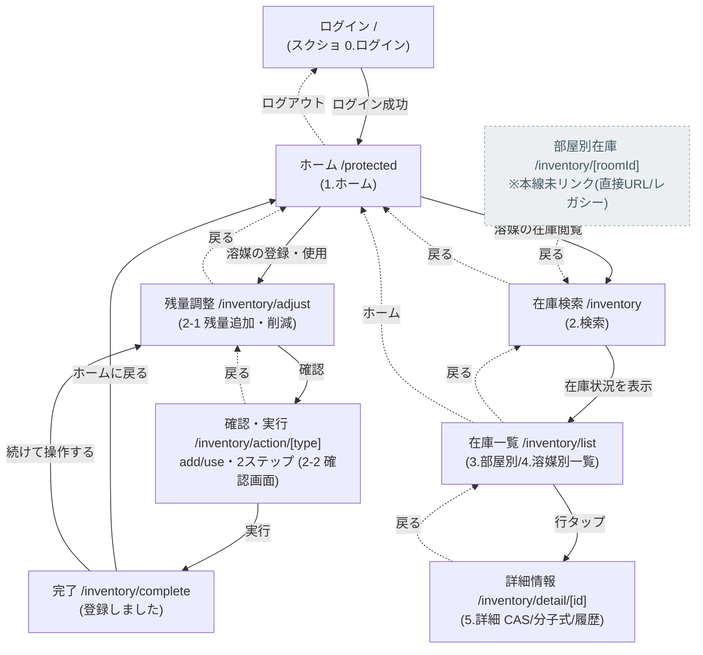
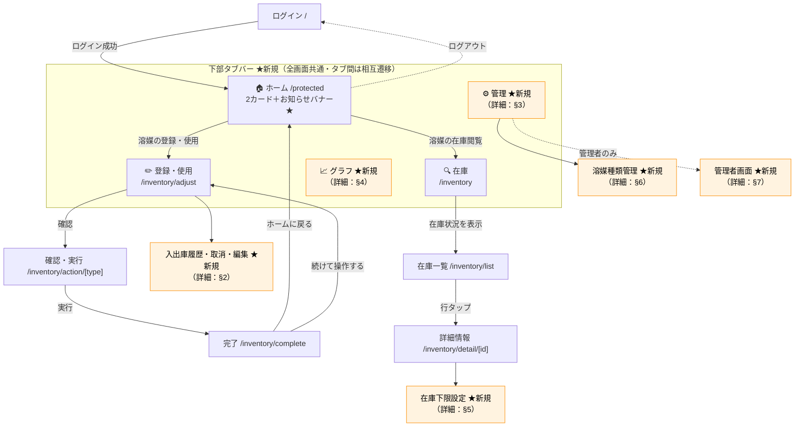
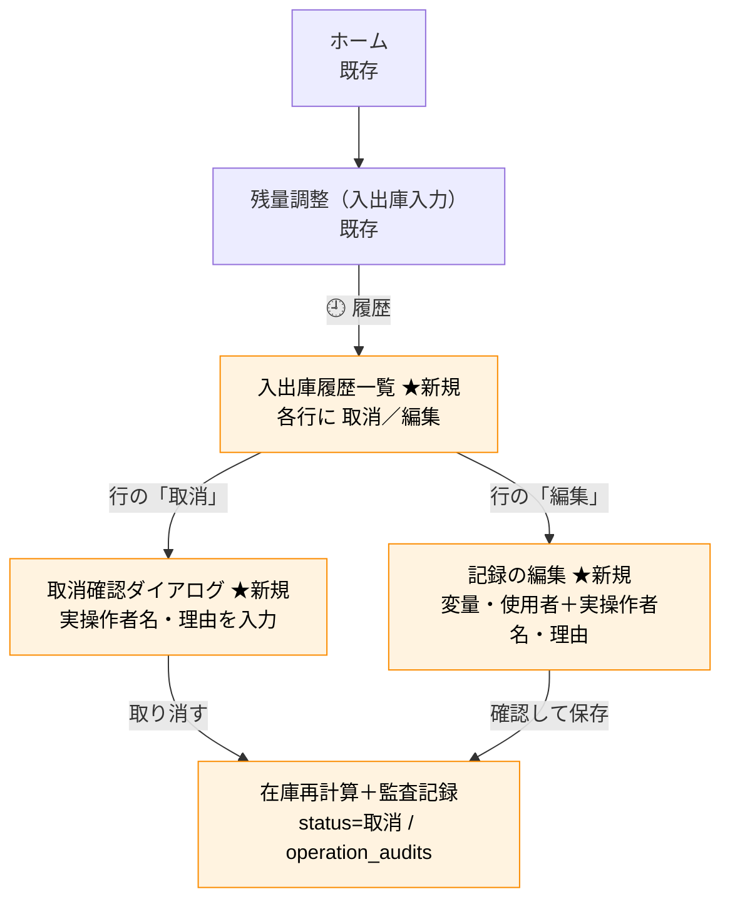
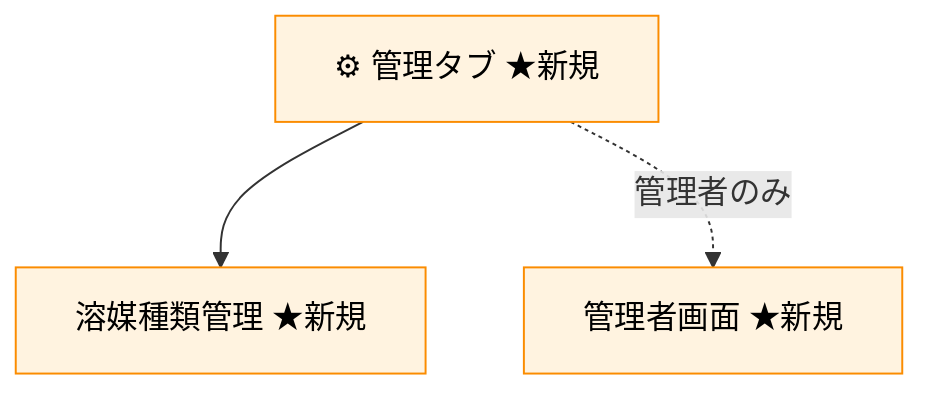
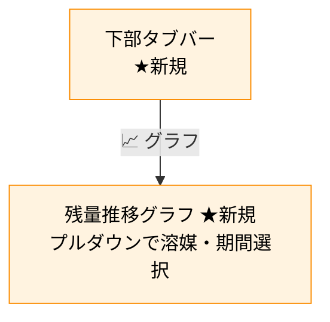
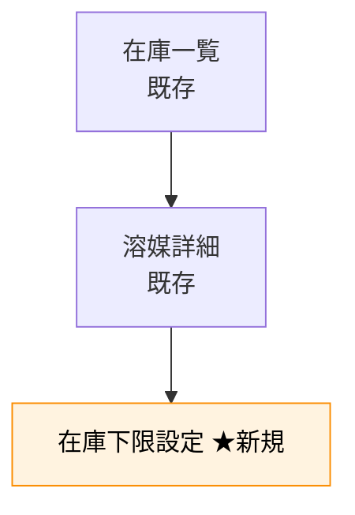
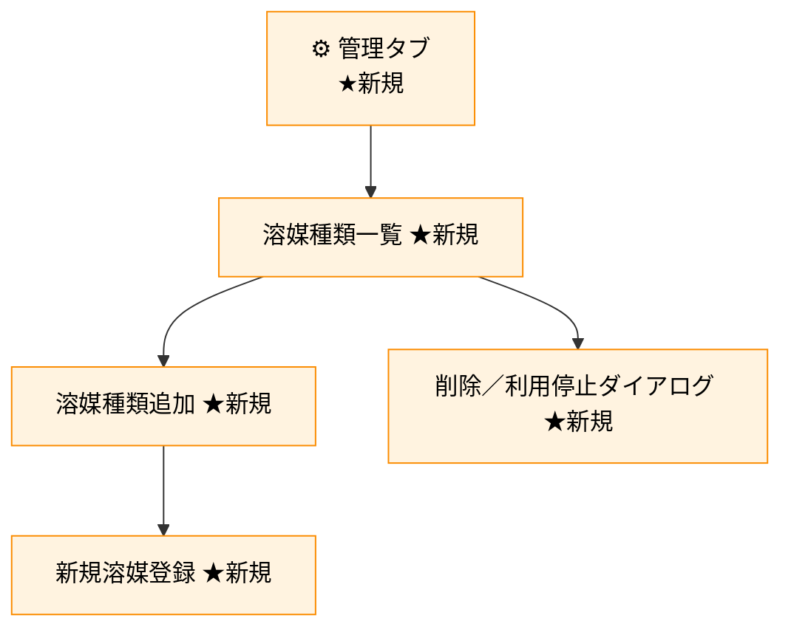
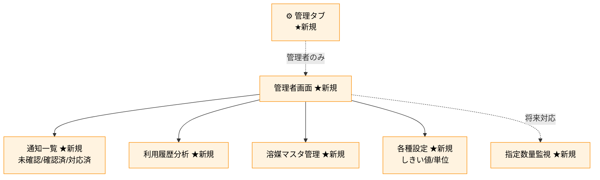

# ChemStock 画面遷移図

**方針**：既存の実装済み画面の主要な遷移を維持し、新機能を接続する。部屋選択と在庫表示範囲は、所属研究室をアカウントから決める認可設計に合わせて更新する。
図中 `★新規` は追加する画面。それ以外は既存の画面で、所属研究室の表示・選択方法を修正する。

**ナビゲーション方針**：スマホでの操作性を優先し、**下部タブバー（5タブ）** を導入する（ログイン画面以外の全画面に常時表示）。
タブは「🏠 ホーム／✏️ 登録・使用／🔍 在庫／📈 グラフ／⚙️ 管理」の5つ。全機能が常時1タップで見えるため、「その他」のような中身の見えないハブ画面を作らない。
既存画面の主要なフローにタブバーを追加する。ホームは既存の主要2カードを維持し、残量低下のお知らせバナーを追加する（「入口＋通知」の役割）。研究室・溶媒庫管理アカウントは所属研究室を固定表示し、全体管理者だけ研究室を選択する。
溶媒種類管理は在庫検索（`/inventory`）とは別系統の独立機能として「管理」タブに配置する。

---

## 1. 既存の画面遷移（現在の実装／実画面版）

実コードに基づく現状の遷移。各ノードに **ルート** と **スクショ内の画面番号/名称**（`docs/スクリーンショット 2026-07-01 16.18.09 copy.png`）を併記。
**実線＝順方向の主遷移**、**点線＝戻る／ログアウト／補助遷移**。

> **補足（既存ルートの扱い）**
> - `/inventory/[roomId]`：ページは存在するが本線からのリンクなし。直接URL用またはレガシーのため図ではグレー表示。実装時は所属研究室以外を表示せず、全体管理者のみ任意の研究室を参照できるようにする。
> - `/home`：`/protected` とは別に存在するが、アプリ内の主要導線はすべて `/protected` を指すため、実運用のホームは `/protected`。`/home` は本線未使用。
> - ログイン系は `/`（本アプリのログイン画面）を使用。`/auth/*` は別系統（Supabase 認証まわり）。

---

## 1-B. 追加後の全体画面遷移図（既存＋★新規）

既存遷移に、所属研究室による対象固定、下部タブバーとセクション2〜7で追加する新機能（`★新規`）を重ねた統合図。
図が大きくなりすぎないよう、**★新規部分は機能単位の代表ノードに集約**（詳細な画面分岐は各セクションの個別図を参照）。
**白ノード＝既存**、**オレンジ＝★新規**。実線＝主遷移、点線＝ログアウト／条件付き／将来対応。

> この統合図は全体像の把握用。各機能内部の詳細な分岐・条件はセクション2〜7の個別図を参照。
> タブバーは確認・完了などの下層画面でも表示したまま（ログイン画面のみ非表示）。
> 残量低下のお知らせは既存ホームに**バナー追加**（遷移は変えない）ため、代表ノード内に併記のみ。

---

## 2. 追加：入出庫の履歴・取消（削除）・編集

**入出庫まわり**に履歴を置き、その履歴から取消・編集する（「使用・追加の履歴を削除する」＝履歴の近くに削除があるべき、という考え方）。
UI上のラベルは「取消」だが、**物理削除ではなく** `inventory_logs.status='取消'` への変更＋在庫再計算＋監査記録で実現する（[ER図](ER図.md) の §2 業務ルール）。
各ノードは [ui-mockup/index.html](ui-mockup/index.html) の「✏️ 登録・使用フロー」の画面と1対1で対応する。

> 入出庫履歴一覧は残量調整（入出庫入力）画面の「🕘 履歴」から開く。各行の取消・編集で実操作者名・理由を入力 → 監査記録（before/after＋理由）→ 在庫再計算（[ER図](ER図.md)）。共有アカウントのため実操作者名は手入力必須。

---

## 3. 追加：下部タブバー（5タブ）と「管理」タブ

「その他」のような中身の見えないハブ画面は作らず、**下部タブバー5タブ**で全機能へ常時1タップアクセスできるようにする。
既存画面の主要な遷移を維持して、認証後レイアウトにタブバーを追加する。所属研究室の表示・選択は本書冒頭の認可方針に合わせる。

| タブ | 遷移先 | 備考 |
|---|---|---|
| 🏠 ホーム | `/protected`（既存） | 主要2カード維持＋残量低下お知らせバナー★ |
| ✏️ 登録・使用 | `/inventory/adjust`（既存） | 入出庫履歴への入口を追加（§2） |
| 🔍 在庫 | `/inventory`（既存） | 検索→一覧→詳細を維持。研究室・溶媒庫管理の対象は所属研究室に固定 |
| 📈 グラフ | 残量推移グラフ ★新規 | §4 |
| ⚙️ 管理 | 管理メニュー ★新規 | 下図参照 |

> - タブバーはログイン画面以外の全画面（確認・完了などの下層画面含む）に常時表示。アクティブタブを濃緑でハイライト。
> - 「管理」タブは項目リスト型の画面。管理者ロールの場合のみ「管理者画面」の項目を表示する（研究室ユーザーには非表示。タブ自体は全ロール共通の5つ）。
> - 溶媒種類管理は在庫検索（`/inventory`）とは別系統の独立導線とし、在庫検索画面には手を入れない。

---

## 4. 追加：残量推移グラフ（「グラフ」タブ直下）

**下部タブバーの「📈 グラフ」タブから**直接開く（中間画面なし）。溶媒・期間はプルダウンで選択。

---

## 5. 追加：在庫下限設定

在庫の閲覧導線（既存の在庫一覧／溶媒詳細）にぶら下げる。

---

## 6. 追加：研究室別 溶媒種類管理（「管理」タブ配下）

在庫検索（`/inventory`）とは切り分け、**「⚙️ 管理」タブから独立して開く**。

---

## 7. 追加：管理者画面（管理者ロールのみ／「管理」タブ配下）

**「⚙️ 管理」タブ内に管理者だけ見える項目を追加**（研究室ユーザーには非表示）。

> 残量低下のお知らせは既存ホームに**バナー追加**（遷移は変えない）。指定数量が1.0以上の場合はアプリ内通知一覧へ記録し、メールは送信しない。研究室ユーザーには非表示。

---

## 補足

- **既存画面の中身・フローは固定**。新機能は「既存画面からの分岐 ★新規」か「下部タブバーの新タブ（グラフ・管理）」で接続。ナビゲーション層（タブバー）だけを既存画面に被せる。
- **下部タブバー5タブ**（🏠 ホーム／✏️ 登録・使用／🔍 在庫／📈 グラフ／⚙️ 管理）：全機能が常時1タップで見え、「その他」のような中身の見えないハブ画面を作らない。ログイン画面以外の全画面に常時表示。
- **ホームは主要2カード維持＋残量低下お知らせバナー追加**：タブと入口が重複しても既存カードは変更しない（変更コストゼロ、ホームは「入口＋通知」の役割）。
- **管理者専用機能は「管理」タブ内の項目出し分け**で対応：タブ数はロールによらず5つで固定。
- **溶媒種類管理は在庫検索と別系統**：「管理」タブ配下の独立した導線とし、在庫検索画面（`/inventory`）には変更を加えない。
- **取消・編集は入出庫履歴の近く**、**在庫下限設定は溶媒詳細の近く**に配置（使いやすさ優先）。
- **スマホ前提・スクロール最小**：選択肢はプルダウン、確認はダイアログ、長い一覧はページング、入力は必須のみ表示＋任意は折りたたみ。
- 新画面のUIは [UI案.md](UI案.md) と [ui-mockup/index.html](ui-mockup/index.html)（HTMLモックアップ）を参照。既存UI（`スクリーンショット 2026-07-01 16.18.09 copy.png`）のミントグリーン基調に合わせる。
- データ構造は [ER図](ER図.md) を参照。
